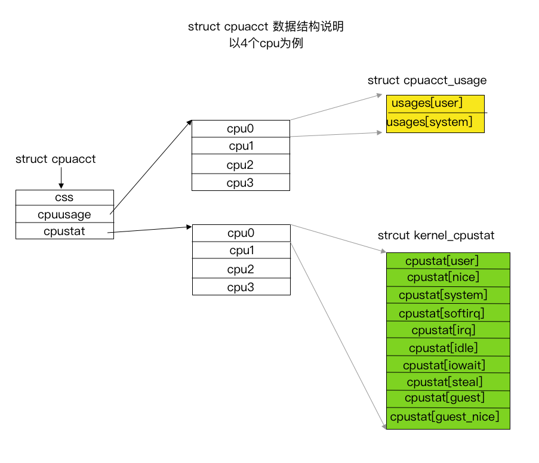

`cpuacct子系统`（CPU accounting）会自动生成报告来显示`cgroup中`任务所使用的`CPU`资源，其中包括子群组任务。报告有两大类：

* `usage`: 统计`cgroup`中进程使用CPU的时间，单位为纳秒。
* `stat`: 统计`cgroup`中进程使用CPU的时间，单位为`USER_HZ`。


>  注意：本文中引用的内核代码版本为`v5.2`


<!--more-->


## 统计文件示例

### usage*

* `cpuacct.usage` : 报告一个`cgroup`中所有任务（包括其子孙层级中的所有任务）使用`CPU`的总时间（纳秒）,该文件时可以写入`0`值的，用来进行重置统计信息。
* `cpuacct.usage_percpu`: 报告一个`cgroup`中所有任务（包括其子孙层级中的所有任务）在每个`CPU`使用`CPU`的时间（纳秒）。
* `cpuacct.usage_user`: 报告一个`cgroup`中所有任务（包括其子孙层级中的所有任务）使用用户态`CPU`的总时间（纳秒）。
* `cpuacct.usage_percpu_user`  报告一个`cgroup`中所有任务（包括其子孙层级中的所有任务）在每个`CPU`上使用用户态`CPU`的时间（纳秒）。
* `cpuacct.usage_sys`: 报告一个`cgroup`中所有任务（包括其子孙层级中的所有任务）使用内核态`CPU`的总时间（纳秒）。
* `cpuacct.usage_percpu_sys`：报告一个`cgroup`中所有任务（包括其子孙层级中的所有任务）在每个`CPU`上使用内核态`CPU`的时间（纳秒）。
* `cpuacct.usage_all`：详细输出文件`cpuacct.usage_percpu_user`和`cpuacct.usage_percpu_sys`的内容。

### stat

* `cpuacct.stat`：报告cgroup的所有任务（包括其子孙层级中的所有任务）使用的用户和系统CPU时间，方式如下：
  * `user`——用户模式中任务使用的CPU时间
  * `system`——系统模式中任务使用的CPU时间
  * 其单位为`USER_HZ`

## 示例

### 查看使用cpu的总时间

```Bash
root@2d1230403171:~# cat /sys/fs/cgroup/cpuacct/cpuacct.usage
3907906171712
root@2d1230403171:~# cat /sys/fs/cgroup/cpuacct/cpuacct.usage_percpu
982052931576 496801928082 1119303415003 1309764865266 
```

### 查看用户态和内核态的CPU时间

```Bash
root@2d1230403171:~# cat /sys/fs/cgroup/cpuacct/cpuacct.usage_user 
3907908045318
root@2d1230403171:~# cat /sys/fs/cgroup/cpuacct/cpuacct.usage_percpu_user                                                                                                    
982051860949 496800539857 1119297079712 1309763110228 
root@2d1230403171:~# cat /sys/fs/cgroup/cpuacct/cpuacct.usage_sys         
0
root@2d1230403171:~# cat /sys/fs/cgroup/cpuacct/cpuacct.usage_percpu_user 
982052487842 496801115881 1119301915660 1309764696892 
```

### 查看cpuacct.usage_all

```Bash
root@2d1230403171:~# cat /sys/fs/cgroup/cpuacct/cpuacct.usage_all   
cpu user system
0 982052931576 0
1 496802375225 0
2 1119304751435 0
3 1309766189582 0
```

### 重置统计值

```bash
root@2d1230403171:~# echo 0 > /sys/fs/cgroup/cpuacct/cpuacct.usage
```
> 注意：需要有相应的权限才能重置。

### 查看stat

```bash
root@2d1230403171:~# cat /sys/fs/cgroup/cpuacct/cpuacct.stat      
user 389913
system 403
```

### Usage 和 Stat 到底有什么区别呢？


```Bash
root@2d1230403171:~# cd /sys/fs/cgroup/cpuacct
root@2d1230403171:/sys/fs/cgroup/cpuacct# cat cpuacct.stat ; cat cpuacct.usage_user;  cat cpuacct.usage_sys
user 124526 
system 468815
4070860587371
354066574154
```

我们可以看到，`stat`中的`user`时间加上的`system`时间和`cpuacct.usage_user`的时间加上`cpuacct.usage_sys`的时间不相等。到底哪个比较精确呢？

`cpuacct.usage` 统计了所有 `CPU` 核的累加使用时间，单位是**纳秒**。在 `cpuacct.stat` 中统计了该控制组中进程用户态和内核态的`CPU`使用量，其单位是`USER_HZ`。

注意，相比 `cpuacct.stat` 来说，`cpuacct.usage` 的值会更加精确一些。

## 内核实现

### 结构体struct cpuacct

`cpuacct`的内核实现中，对`cpu`时间的统计结果都存放到数据结构`struct cpuacct`中，数据结构定义如下：

```C
/* track CPU usage of a group of tasks and its child groups */
struct cpuacct {
	struct cgroup_subsys_state	css;
	/* cpuusage holds pointer to a u64-type object on every CPU */
	struct cpuacct_usage __percpu	*cpuusage;
	struct kernel_cpustat __percpu	*cpustat;
};
```

除了css外，其他两个成员都是`__percpu`类型。

* `cpuusge` 记录每个`cpu`使用的时间, 单位为纳秒
* `cpustat` 记录每个`cpu`使用的用户和系统`CPU`时间，单位为`USER_HZ`

### 结构体 struct cpuacct_usage 

数据结构定义如下：

```C
/* Time spent by the tasks of the CPU accounting group executing in ... */
enum cpuacct_stat_index {
	CPUACCT_STAT_USER,	/* ... user mode */
	CPUACCT_STAT_SYSTEM,	/* ... kernel mode */

	CPUACCT_STAT_NSTATS,
};

static const char * const cpuacct_stat_desc[] = {
	[CPUACCT_STAT_USER] = "user",
	[CPUACCT_STAT_SYSTEM] = "system",
};

struct cpuacct_usage {
	u64	usages[CPUACCT_STAT_NSTATS];
};
```

### 结构体 struct kernel_cpustat

数据结构定义如下：


```C
/*
 * 'kernel_stat.h' contains the definitions needed for doing
 * some kernel statistics (CPU usage, context switches ...),
 * used by rstatd/perfmeter
 */

enum cpu_usage_stat {
	CPUTIME_USER,
	CPUTIME_NICE,
	CPUTIME_SYSTEM,
	CPUTIME_SOFTIRQ,
	CPUTIME_IRQ,
	CPUTIME_IDLE,
	CPUTIME_IOWAIT,
	CPUTIME_STEAL,
	CPUTIME_GUEST,
	CPUTIME_GUEST_NICE,
	NR_STATS,
};

struct kernel_cpustat {
	u64 cpustat[NR_STATS];
};
```

`cpuacct.stat`中的统计时间主要来源于该结构体，其中

* user时间包括：CPUTIME_USER + CPUTIME_NICE
* system时间包括：CPUTIME_IRQ + CPUTIME_SOFTIRQ + CPUTIME_SYSTEM

### 变量root_cpuacct

定义如下： 和

```C
struct kernel_cpustat {                                                                                                           
        u64 cpustat[NR_STATS];
};

DECLARE_PER_CPU(struct kernel_cpustat, kernel_cpustat);


static DEFINE_PER_CPU(struct cpuacct_usage, root_cpuacct_cpuusage);
static struct cpuacct root_cpuacct = {
	.cpustat	= &kernel_cpustat,
	.cpuusage	= &root_cpuacct_cpuusage,
};

```

通过上面的数据结构分析，我们可以画出`struct cpuacct`的结构示意图：



`/sys/fs/cgroup/cpuacct`下所有统计文件就是通过`cpuacct`结构体中的统计值来输出信息的。


而`cpu`时间信息的更新则由如下函数完成()。

* `cpuacct_charge`

  > 用于更新cpuusage(), 该函数更新所有的`cpuacct cgroup`，包括根`root cpuacct cgroup`。

* `cpuacct_account_field`

  > 用于更新cpustat()，该函数更新所有的`cpuacct cgroup`，但不包括`root cpuacct  cgroup`。

### 那么哪些函数会调用`cpuacct_charge`呢？

如下函数会去调用`cpuacct_charge`:

* `update_curr(struct cfs_rq *cfs_rq)`->`cgroup_account_cputime`->`cpuacct_charge`
* `update_curr_rt(struct rq *rq)`->`cgroup_account_cputime`->`cpuacct_charge`
* `update_curr_dl(struct rq *rq)`->`cgroup_account_cputime`->`cpuacct_charge`
* `put_prev_task_stop(struct rq *rq, struct task_struct *prev)`->`cgroup_account_cputime`->`cpuacct_charge`

### 那么哪些函数会调用`cpuacct_account_field`呢？

如下函数会去调用`cpuacct_account_field`:

* `account_process_tick`->`account_user_time`->`task_group_account_field`->`cgroup_account_cputime_field`->`cpuacct_account_field`
* `irqtime_account_process_tick`->`account_user_time`->`task_group_account_field`->`cgroup_account_cputime_field`->`cpuacct_account_field`
* `vtime_user_exit`->`account_user_time`->`task_group_account_field`->`cgroup_account_cputime_field`->`cpuacct_account_field`

* `account_process_tick`->`account_system_time`->`account_system_index_time`->`task_group_account_field`->`cgroup_account_cputime_field`->`cpuacct_account_field`
* `irqtime_account_process_tick`->`account_system_index_time`->`task_group_account_field`->`cgroup_account_cputime_field`->`cpuacct_account_field`
* `__vtime_account_system`->`account_system_time`->`account_system_index_time`->`task_group_account_field`->`cgroup_account_cputime_field`->`cpuacct_account_field`


除此之外，还有如下函数会更新`cupstat`

* `account_idle_time`
* `account_steal_time`
* `account_guest_time`

### 总结一下

更新cpustat的接口有如下几个：

* `account_user_time`
* `account_system_time`
* `irqtime_account_process_tick`
* `account_idle_time`
* `account_steal_time`
* `account_guest_time`


## 分析更新cpustat的接口实现

### account_user_time

代码地址为：

该接口根据`task_nice(p)`是否为真，更新`CPUTIME_NICE`或者`CPUTIME_NICE`

### account_system_time

代码地址为：

该接口根据不同的情况可能更新`CPUTIME_IRQ` 或者 `CPUTIME_SOFTIRQ` 或者 `CPUTIME_SYSTEM`

> 注意，该接口还有可能通过接口`account_guest_time`进行时间的更新。

### account_idle_time

代码地址为：

该接口更新了` CPUTIME_IDLE`或者`CPUTIME_IOWAIT`，只更新了`root cpuacct`，即`idle`时间不是`cgroup aware`的。

### account_steal_time

代码地址为：

该接口更新了` CPUTIME_STEAL`，只更新了`root cpuacct`，即`steal`时间不是`cgroup aware`的。

### account_guest_time

代码地址为：

该接口根据`task_nice(p)`是否为真，更新`CPUTIME_NICE and CPUTIME_GUEST_NICE`或者`CPUTIME_USER and CPUTIME_GUEST`, 只更新了`root cpuacct`，即`guest`时间不是`cgroup aware`的。


## 其它相关问题

### root cpuacct的数据来源？

* `root cpuacct cgroup`中`usage`来源于变量`root_cpuacct_cpuusage`，在`cpuacct_charge`中会更新它的值。
* `root cpuacct cgroup`中`cpustat`来源于变量`kernel_cpustat`,`cpuacct_account_field`并不会更新它，而是有系统上其它部分去更新。

### /proc/stat中cpu相关统计信息来自哪里？

* `/proc/stat`中cpu相关统计数据来自于变量`kernel_cpustat`,这个跟`root cpuacct cgroup`的数据来源是一样的。

### docker如何计算容器的`cpu`利用率？

`docker`容器的的cpu利用率计算公司如下：
```
	(cpuuasge的delta值/墙上时间delta) * 100%
```

* `cpuuasge`的`delta`值： 通过两次读取`cpuacct.useage`得到
* 墙上时间`delta`： 通过两地读取`/proc/stat`的第一行得到，由于该行的值为**墙上时间*cpu核数**，所以该值应该再除以`cpu`核数。
