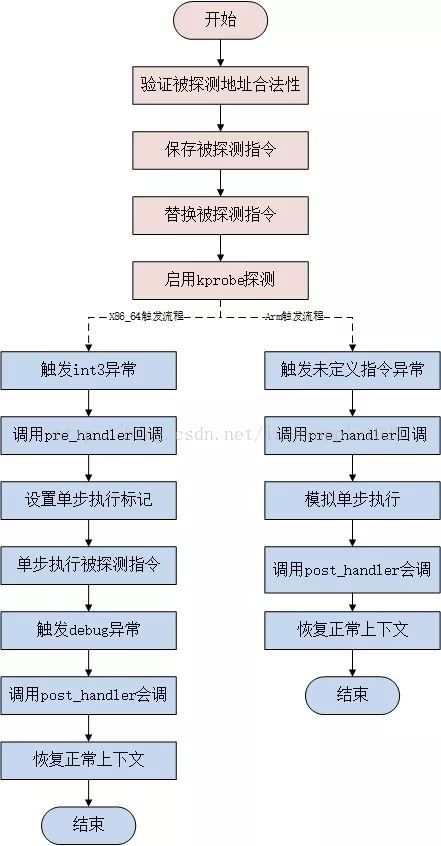
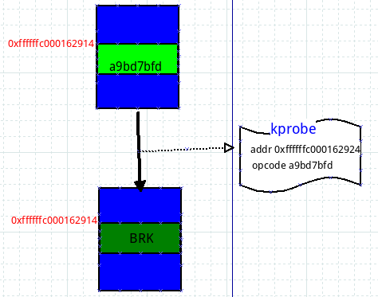
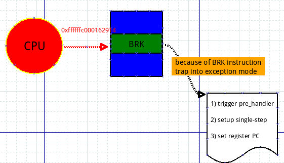
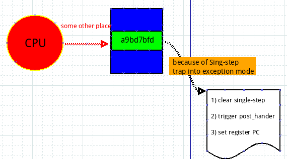
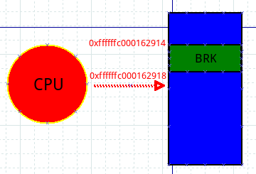

Linux kprobes调试技术是内核开发者们专门为了便于跟踪内核函数执行状态所设计的一种轻量级内核调试技术。利用kprobes技术，内核开发人员可以在内核的绝大多数指定函数中动态的插入探测点来收集所需的调试状态信息而基本不影响内核原有的执行流程。

本文将介绍kprobe的用法和解析其工作原理。
<!--more-->

###  kprobe是什么？
如何高效地调试内核？printk是一种方法，但是printk终归是毫无选择地全量输出，某些场景下不实用，于是你可以试一下tracepoint，我使能tracepoint机制的时候才输出。对于傻傻地放置printk来输出信息的方式，tracepoint是个进步，但是tracepoint只是内核在某些特定行为（比如进程切换）上部署的一些静态锚点，这些锚点并不一定是你需要的，所以你仍然需要自己部署tracepoint，重新编译内核。那么kprobe的出现就很有必要了，它可以在运行的内核中动态插入探测点，执行你预定义的操作。

### kprobe的使用方法

最早的时候，使用kprobe一般都是编写内核模块，在模块中定义pre-handler和post-handler函数，然后使用kprobe的API（register_kprobe）来进行注册kprobe。加载模块后，pre-handler和post-handler函数中国年的printk()就会打印定制的信息到系统日志中，当然卸载内核模块时，需要调用API（unregister_kprobe）来进行注销操作。

总结一下，目前有三种使用kprobe的接口：

* kprobe API：register_kprobe()等等
* 基于Ftrace的/sys/kernel/debug/tracing/kprobe_events接口，通过写特定的配置文件
* perf_event_open()，通过perf工具，在最新的内核上，BPF tracing也是通过这种方式

kprobes的最大使用者都是一些tracer的前端工具，比如perf、systemtap、BPF 跟踪(BCC和bpftrace)

> 注意：最开始的kprobe实现中还有一个变种叫做jprobe，用于在函数入口添加探测点。但是后来发现，其功能完全可以通过kprobe来实现，所以2018年，jprobe就被社区的维护者给删除了。

### kprobe的工作原理

上一节和大家简要说明了下kprobe到底应该怎样用，那么现在我们就揭开kprobe神秘的面纱，刨根问底，一睹kprobe的庐山真面目。

从网上找了一个流程图，可以参考一下：




kprobe的工作原理如下：

1. 注册kprobe后，注册的每一个kprobe对应一个kprobe结构体，该结构中记录着探测点的位置，已经该探测点本来对应的指令。

2. 探测点的位置被替换成了一条异常的指令，这样当CPU执行到探测点位置时会陷入到异常态，在x86_64上指令是int3（如果kprobe经过优化后，指令是jmp）

3. 当执行到异常指令时，系统换检查是否是kprobe 安装的异常，如果是，就执行kprobe的pre_handler,然后利用CPU提供的单步调试（single-step）功能，设置好相应的寄存器，将下一条指令设置为插入点处本来的指令，从异常态返回；

4. 再次陷入异常态。上一步骤中设置了single-step相关的寄存器，所以originnal_opcode刚一执行，便会二进宫：再次陷入异常态，此时将single-step清除，并且执行post_handler，然后从异常态安全返回.


5. 当卸载kprobe时，探测点原来的指令会被恢复回去。

步骤2），3），4）便是一次kprobe工作的过程，它的一个基本思路就是将本来执行一条指令扩展成执行kprobe->pre_handler ---> 指令 ---> kprobe-->post_hander这样三个过程。


下面详细解释每个过程：

#### 指令替换过程



上图中蓝色区域表示内存，红色标明了地址，绿色部分代表一条指令，上图的意思是，内存`0xfffffc000162914`处存放一条指令是`0xa9bd7bfd`。那么，现在我注册了一个kprobe，探测点是`sys_write`函数，该函数的起始位置就是`0xffffffc000162914`，现在我要使能kprobe了，那么我要做的就是把`0xffffffc000162914`处原来的指令`0xa9bd7bfd`替换成一条`BRK`指令，即上图所表示的一个移花接木过程。你可能会好奇原来的指令`0xa9bd7bfd`存在哪里？存在kprobe结构体的`opcode域`！这样当不再使能kprobe的时候，我再恢复回去。


#### 触发异常指令

上面把人家指令给改了，那么CPU执行到BRK必然会引发内核陷入BRK异常状态：



蓝色部分依旧表示内存，绿色部分表示指令，红色表示CPU，上图表示CPU执行到0xffffffc000162914（sys_write）处，该处指令为BRK，于是内核陷入异常态。在异常态中，内核通过BRK指令的错误码判断这是一个kprobe异常，于是进入了kprobe处理函数。kprobe异常处理函数会根据发生异常的地址来找到对应的kprobe（kprobe的addr域记录着地址），执行kprobe的pre_handler函数，然后设置single-step相关的寄存器，为下一步执行原指令时发生single-step异常作准备。那么紧接着就是设置原指令的地址了，我们知道0xffffffc000162914处已经被替换成了BRK指令，原指令保存在kprobe结构体中，怎么保证下一步执行到原指令呢？最简单的做法是申请一块内存，然后将原指令复制到这块内存开始处，设置PC寄存器为该内存的首地址，这样当代码从异常态返回时，执行的第一条指令便是原指令了！


#### 原指令得到执行，二进宫

经过上面一个步骤，pre_handler得到了执行，从异常态返回之后，原指令也得到了执行，但是由于设置了single-step模式，所以执行完原指令，马上又陷入了异常态，二进宫：



这次进入异常态后，先清一下single-step相关的寄存器，确保下次从异常返回时的指令不会由于single-step发生三进宫，然后执行post_handler，最后将地址0xfffffc000162918写入到PC寄存器，为什么是这个数值呢？它正是紧接着0xffffffc000162914的下一条指令的地址，有没有发现，至此我们已经完成了pre_handler->原指令->post_handler这样三个阶段，也就是说kprobe要做的事情都做完了，此时的工作就是收拾下残局，返回到正常的指令流程，我们的探测点在0xffffffc000162914处，下一条指令应该就是0xffffffc000162918了，所以把此值写入PC寄存器，让一切恢复正轨！


#### kprobe工作结束



上面把PC设置成了0xffffffc000162918，所以从异常态返回时，CPU就走上了正轨接着朝下面执行了，一个BRK指令引发的反应在此就告一段落了，但是每次当CPU执行到0xffffffc000162914处，都会触发上面的一连串操作，kprobe的机制也就是从一个BRK指令开始了。

> 由于kprobe涉及到程序指令的修改，这部分和体系结构相关，我选择的体系结构ARM64，如本文的BRK指令等均是ARM64中的概念， x86中INT3与之对应。

#### 卸载kprobe


卸载kprobe后，原理0xffffffc000162914出的指令就会恢复成0xa9bd7bfd。


#### x86_64下kprobe的分析

我们以内核代码中的[samples/kprobes/kprobe_example.c](https://github.com/torvalds/linux/blob/master/samples/kprobes/kprobe_example.c)为例

该模块默认的探测点是：`_do_fork`这个内核函数，再插入模块前，`_do_fork`处的代码指令为：
```
crash> dis _do_fork
0xffffffffa30af440 <_do_fork>:  nopl   0x0(%rax,%rax,1) [FTRACE NOP]
0xffffffffa30af445 <_do_fork+5>:        push   %r15
0xffffffffa30af447 <_do_fork+7>:        mov    %rdi,%r15
0xffffffffa30af44a <_do_fork+10>:       push   %r14
0xffffffffa30af44c <_do_fork+12>:       push   %r13
0xffffffffa30af44e <_do_fork+14>:       push   %r12
0xffffffffa30af450 <_do_fork+16>:       push   %rbp
0xffffffffa30af451 <_do_fork+17>:       xor    %ebp,%ebp
0xffffffffa30af453 <_do_fork+19>:       push   %rbx
0xffffffffa30af454 <_do_fork+20>:       sub    $0x30,%rsp
0xffffffffa30af458 <_do_fork+24>:       mov    %rcx,(%rsp)
0xffffffffa30af45c <_do_fork+28>:       mov    %r8,%rcx
0xffffffffa30af45f <_do_fork+31>:       mov    %gs:0x28,%rax
0xffffffffa30af468 <_do_fork+40>:       mov    %rax,0x28(%rsp)
0xffffffffa30af46d <_do_fork+45>:       xor    %eax,%eax
0xffffffffa30af46f <_do_fork+47>:       test   $0x800000,%edi
0xffffffffa30af475 <_do_fork+53>:       jne    0xffffffffa30af4ba <_do_fork+122>
0xffffffffa30af477 <_do_fork+55>:       test   $0x4000,%edi
0xffffffffa30af47d <_do_fork+61>:       jne    0xffffffffa30af5bc <_do_fork+380>
```
我们可以看到，默认情况下：`_do_fork`的位置是`nopl   0x0(%rax,%rax,1)`指令，这个跟FTRACE有关系。

注册kprobe后，指令为`callq  0xffffffffc02ea000`

```
crash> dis _do_fork
0xffffffffa30af440 <_do_fork>:  callq  0xffffffffc02ea000
0xffffffffa30af445 <_do_fork+5>:        push   %r15
0xffffffffa30af447 <_do_fork+7>:        mov    %rdi,%r15
0xffffffffa30af44a <_do_fork+10>:       push   %r14
0xffffffffa30af44c <_do_fork+12>:       push   %r13
0xffffffffa30af44e <_do_fork+14>:       push   %r12
0xffffffffa30af450 <_do_fork+16>:       push   %rbp
0xffffffffa30af451 <_do_fork+17>:       xor    %ebp,%ebp
0xffffffffa30af453 <_do_fork+19>:       push   %rbx
0xffffffffa30af454 <_do_fork+20>:       sub    $0x30,%rsp
0xffffffffa30af458 <_do_fork+24>:       mov    %rcx,(%rsp)
0xffffffffa30af45c <_do_fork+28>:       mov    %r8,%rcx
0xffffffffa30af45f <_do_fork+31>:       mov    %gs:0x28,%rax
0xffffffffa30af468 <_do_fork+40>:       mov    %rax,0x28(%rsp)
0xffffffffa30af46d <_do_fork+45>:       xor    %eax,%eax
0xffffffffa30af46f <_do_fork+47>:       test   $0x800000,%edi
```
这里不是上面提到的int3指令，是因为和ftrace有关系，有机会再深入分析。不过我们可以看到，探测点的位置被保存到了kprobe结构体中：


```
crash> kprobe.addr 0xffffffffc0998000
  addr = 0xffffffffa30af440 "軫#\035AWI\211\377AVAUATU1\355SH\203\354\060H\211\f$L\211\301eH\213\004%("
crash>  sym 0xffffffffa30af440
ffffffffa30af440 (T) _do_fork /usr/src/debug/kernel-4.18.0-147.0.3.el8_1/linux-4.18.0-147.mt20200626.413.el8_1.x86_64/kernel/fork.c: 2219
```

### 参考文章

* https://www.cnblogs.com/honpey/p/4575928.html
* https://www.cnblogs.com/honpey/p/4575902.html
* http://www.brendangregg.com/bpf-performance-tools-book.html
* https://www.kernel.org/doc/Documentation/kprobes.txt

