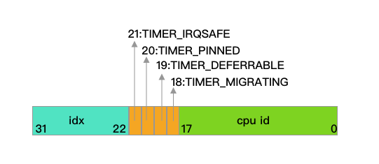

定时器层是基于`Tick`层之上的，是根据系统`jiffies`来触发的，精度相对比较低。利用定时器，我们可以设定在未来的某一时刻，触发一个特定的事件。经常，也会把这种低精度定时器称作时间轮（`Timer Wheel`）。

本文将详细分析内核中低精度定时器的实现。

<!--more-->

>  注意：本文分析中引用的代码来自于：[kernel-4.18.0-147.8.1.el8_1.src.rpm](http://vault.centos.org/8.1.1911/BaseOS/Source/SPackages/kernel-4.18.0-147.8.1.el8_1.src.rpm)

### 定时器基本数据结构timer_list 

在内核中，一个定时器是使用`timer_list`结构体来表示的:
```c
struct timer_list {
	/*
	 * All fields that change during normal runtime grouped to the
	 * same cacheline
	 */
	struct hlist_node	entry;
	unsigned long		expires;
	void			(*function)(struct timer_list *);
	u32			flags;

#ifdef CONFIG_LOCKDEP
	struct lockdep_map	lockdep_map;
#endif
	RH_KABI_RESERVE(1)
	RH_KABI_RESERVE(2)
	RH_KABI_RESERVE(3)
	RH_KABI_RESERVE(4)
};
```
* `entry`：所有的定时器都会根据到期的时间被分配到一组链表中的一个中，该字段是链表的节点成员。
* `expires`：字段指出了该定时器的到期时刻，也就是期望定时器到期时刻的`jiffies`计数值。这是一个绝对值，不是距离当前时刻再过多少`jiffies`。
* `function`：是一个回调函数指针，定时器到期时，系统将会调用该函数，用于响应该定时器的到期事件。
* `flags`：看名字应该是标志位，其定义如下：
```
#define TIMER_CPUMASK		0x0003FFFF
#define TIMER_MIGRATING		0x00040000
#define TIMER_BASEMASK		(TIMER_CPUMASK | TIMER_MIGRATING)
#define TIMER_DEFERRABLE	0x00080000
#define TIMER_PINNED		0x00100000
#define TIMER_IRQSAFE		0x00200000
#define TIMER_ARRAYSHIFT	22
#define TIMER_ARRAYMASK		0xFFC00000
```
可以看到，`flags`其实并不是标志位那么简单。其最高`10`位记录了定时器放置到桶的编号，后面会提到一共最多只有**576**个桶，所以**10位**足够了。而最低的**18位**指示了该定时器绑定到了哪个`CPU`上，注意是一个数值，而不是位图。夹在中间的一些位到真的是一些标志位。 如下图所示：



* `TIMER_MIGRATING`表示定时器正在从一个CPU迁移到另外一个CPU。
* `TIMER_DEFERRABLE`表示该定时器是可延迟的。
* `TIMER_PINNED`表示定时器已经绑死了当前的CPU，无论如何都不会迁移到别的CPU上。
* `TIMER_IRQSAFE`表示定时器是中断安全的，使用的时候只需要加锁，不需要关中断。

### 定时器基本数据结构timer_base

系统中可能同时存在成千上万个定时器，如果处理不好效率会非常低下。`Linux`目前会将定时器按照绑定的`CPU`和`种类`（普通定时器还是可延迟定时器两种）进行区分，由`timer_base`结构体组织起来：

```c
struct timer_base {
	raw_spinlock_t		lock;
	struct timer_list	*running_timer;
	unsigned long		clk;
	unsigned long		next_expiry;
	unsigned int		cpu;
	bool			is_idle;
	bool			must_forward_clk;
	DECLARE_BITMAP(pending_map, WHEEL_SIZE);
	struct hlist_head	vectors[WHEEL_SIZE];
} ____cacheline_aligned;
```

* `lock`：保护该`timer_base`结构体的自旋锁，这个自旋锁还同时保护包含在`vectors`链表数组中的所有定时器。
* `running_timer`：该字段指向当前`CPU`正在处理的定时器所对应的`timer_list`结构。
* `clk`：当前定时器所经过的`jiffies`，用来判断包含的定时器是否已经到期或超时。
* `next_expiry`：该字段指向该`CPU`下一个即将到期的定时器。最早 (距离超时最近的 `timer`) 的超时时间
* `cpu`：所属的`CPU`号。
* `is_idle`：指示是否处于空闲模式下，在`NO_HZ`模式下会用到。
* `must_forward_clk`：指示是否需要更新当前`clk`的值，在`NO_HZ`模式下会用到。
* `pending_map`：一个比特位图，时间轮中有几个桶就有几个比特位。如果某个桶内有定时器存在，那么就将相应的比特位置`1`。
* `vectors`：时间轮所有桶的数组，每一个元素是一个链表。

每个`CPU`都包含一个或者两个`timer_base`结构体变量：
```c
static DEFINE_PER_CPU(struct timer_base, timer_bases[NR_BASES]);
```

其中`NR_BASES`定义如下：

```
#ifdef CONFIG_NO_HZ_COMMON
# define NR_BASES	2
# define BASE_STD	0
# define BASE_DEF	1
#else
# define NR_BASES	1
# define BASE_STD	0
# define BASE_DEF	0
#endif
```

所以如果内核编译选项包含`CONFIG_NO_HZ_COMMON`，则每个`CPU`有两个`timer_base`结构体，下标分别是`BASE_STD（Standard）`和`BASE_DEF（Deferrable）`。如果内核编译选项没有包含`CONFIG_NO_HZ_COMMON`，那么每个`CPU`只有一个`timer_base`结构体，`BASE_STD`和`BASE_DEF`是同一个。

为什么支持`NO_HZ`模式要包含两个`timer_base`呢？

这其实和`NO_HZ`的工作模式有关。如果`NO_HZ`模式，那么当`CPU`处于空闲状态时，定时器层是收不到也不需要收到任何`Tick`的，这样可以节省电力。这时候底层的`Tick`层（准确说是`Tick Sched`）不会按照预定好的`HZ`频率，每次到期后都去不停的设置底层的定时事件设备（启动`NO_HZ`模式的前提是已经切换到了高精度模式下而高精度模式又要求定时事件设备是单次触发模式的）。但是，如果定时器到期了不就错过去了嘛。所以，在停止`Tick`之前，`Tick`层会从定时器层获得最近的下一次定时器到期的时间（通过调用`get_next_timer_interrupt`函数），然后对下面的定时事件设备进行编程，让其在这个最近的到期时刻到期，触发中断。但是，系统中有很多定时器，它们对到期的要求没有那么严格，迟一点到期也不是很要紧。对于这类定时器，在停止`Tick`之前，就没必要管他们到低什么时候到期。具体点说，**就是Tick层在向定时器层询问下一次最近到期时间时，定时器层更本就不会查找这些可延迟的定时器。**

对于前面说的第一种定时器存放在`BASE_STD`指明的那个`timer_base`结构体里面，而第二种定时器存放在`BASE_DEF`指明的那个`timer_base`结构体里面。如果在编译内核的时候没有包含`CONFIG_NO_HZ_COMMON`，也就是内核不支持`NO_HZ`模式，`Tick`从来就没有停止过，当然就不存在前面说的问题，也就没必要分两个了。

### 定时器层级level

如果在内核配置文件里定义`Tick`周期大于`100`的话，一共有`8`个级别（编号从`0`到`7`）；而如果大于`100`的话，则一共会包含`9`个级别（编号从`0`到`8`）。
```
/* Level depth */
#if HZ > 100
# define LVL_DEPTH	9
# else
# define LVL_DEPTH	8
#endif
```

一个级（`Level`）里面共有`64`（`LVL_SIZE`）个桶（`Bucket`），用`6`个比特表示：

```
/* Size of each clock level */
#define LVL_BITS	6
#define LVL_SIZE	(1UL << LVL_BITS)
#define LVL_MASK	(LVL_SIZE - 1)
#define LVL_OFFS(n)	((n) * LVL_SIZE)
```

宏`LVL_OFFS`定义了每一级桶下表的起始编号。

所以，对于每个`timer_base`一共需要的桶的数目定义为：

```
/*
 * The resulting wheel size. If NOHZ is configured we allocate two
 * wheels so we have a separate storage for the deferrable timers.
 */
#define WHEEL_SIZE	(LVL_SIZE * LVL_DEPTH)
```


### 定时器粒度Granularity

还有一个概念叫做粒度（`Granularity`），表示系统至少要过多少个`Tick`才会检查某一个级里面的所有定时器。

每一级的`64`个桶的检查粒度是一样的，而不同级内的桶之间检查的粒度不同，级数越小，检查粒度越细。每一级粒度的`Tick`数由宏定义`LVL_CLK_DIV`的值决定：

```
/* Clock divisor for the next level */
#define LVL_CLK_SHIFT	3
#define LVL_CLK_DIV	(1UL << LVL_CLK_SHIFT)
#define LVL_CLK_MASK	(LVL_CLK_DIV - 1)
#define LVL_SHIFT(n)	((n) * LVL_CLK_SHIFT)
#define LVL_GRAN(n)	(1UL << LVL_SHIFT(n))
```
具体的计算公式为：

$$ {LVL\\_CLK\\_DIV}^{Level} $$

也就是第`0`级内`64`个桶中存放的所有定时器每个`Tick`都会检查，第`1`级内`64`个桶中存放的所有定时器每`8`个`Tick`才会检查，第`2`级内`64`个桶中存放的所有定时器每`64`个Tick才会检查，以此类推。

对应每一个级，都有一个范围，其起始的`Tick`值由`LVL_START`定义：

```
/*
 * The time start value for each level to select the bucket at enqueue
 * time.
 */
#define LVL_START(n)	((LVL_SIZE - 1) << (((n) - 1) * LVL_CLK_SHIFT))
```

下面具体举个例子，内核配置选项将`HZ`配置位`1000`，那么就一共需要`9`个级别，每个级别里面有`64`个桶，所以一共需要`576`个桶。每个级别的情况如下表：

| 级别          | 编号偏移       | 粒度（Granularity））  | 差值范围          |
| :------------ |---------------:| ----------------------:|------------------:|
|  0 |     0 |        1 ms       |         0 ms -         63 ms |
|  1 |    64 |        8 ms       |        64 ms -        511 ms |
|  2 |   128 |       64 ms       |       512 ms -       4095 ms (512ms - ~4s) |
|  3 |   192 |      512 ms       |      4096 ms -      32767 ms (~4s - ~32s) |
|  4 |   256 |     4096 ms (~4s) |     32768 ms -     262143 ms (~32s - ~4m) |
|  5 |   320 |    32768 ms (~32s)|    262144 ms -    2097151 ms (~4m - ~34m) |
|  6 |   384 |   262144 ms (~4m) |   2097152 ms -   16777215 ms (~34m - ~4h) |
|  7 |   448 |  2097152 ms (~34m)|  16777216 ms -  134217727 ms (~4h - ~1d) |
|  8 |   512 | 16777216 ms (~4h) | 134217728 ms - 1073741822 ms (~1d - ~12d) |

因为配置的是`1000Hz`，所以每次`Tick`之间经过`1`毫秒。可以看出来，定时到期时间距离现在越久，那粒度就越差，误差也越大。

具体将定时器放到哪一个级下面是由到期时间距离现在时间的差值，也就是距离现在还要过多长时间决定的；而要放到哪个桶里面，则单纯是由到期时间决定的。

所以，综上所述，定时器层的数据结构如下图所示：


### 定时器层的工作过程

下面分场景介绍一下定时器层的工作过程。

#### 桶编号的计算
`calc_wheel_index`函数根据到期`jiffies`和已经过`jiffies`两个参数，计算要将定时器放置到哪个桶下：

```
static int calc_wheel_index(unsigned long expires, unsigned long clk)
{
	unsigned long delta = expires - clk; //计算到期jiffies和已经过jiffies的差，保存到delta中
	unsigned int idx;
	//按照差多处的范围决定将定时器放到哪一级
	if (delta < LVL_START(1)) {
		idx = calc_index(expires, 0);
	} else if (delta < LVL_START(2)) {
		idx = calc_index(expires, 1);
	} else if (delta < LVL_START(3)) {
		idx = calc_index(expires, 2);
	} else if (delta < LVL_START(4)) {
		idx = calc_index(expires, 3);
	} else if (delta < LVL_START(5)) {
		idx = calc_index(expires, 4);
	} else if (delta < LVL_START(6)) {
		idx = calc_index(expires, 5);
	} else if (delta < LVL_START(7)) {
		idx = calc_index(expires, 6);
	} else if (LVL_DEPTH > 8 && delta < LVL_START(8)) {
		idx = calc_index(expires, 7);
	} else if ((long) delta < 0) { //如果差值为负值，就把它放到最低级别中，再过一个Tick就能检查到了。
		idx = clk & LVL_MASK;
	} else {
		/*
		 * Force expire obscene large timeouts to expire at the
		 * capacity limit of the wheel.
		 */
		if (expires >= WHEEL_TIMEOUT_CUTOFF) //如果差值过大强制限定过期时间到WHEEL_TIMEOUT_MAX
			expires = WHEEL_TIMEOUT_MAX;

		idx = calc_index(expires, LVL_DEPTH - 1);
	}
	return idx;
}
```
可以看到，**将定时器放到时间轮的哪一级是由距离现在还要过多长时间（准确的说是过多少`jiffies`）才到期决定的**。该函数首先计算到期`jiffies`和当前已经过`jiffies`的差值。然后，根据差值的范围，决定放置到哪一个级别的桶内。

如果差值为负代表其实定时器已经过期了，就把它放到最低级别（`0`）内，反正再过一个`Tick`就能检查到了。

如果差值过大，强制限定到期时间到`WHEEL_TIMEOUT_MAX`，并将其放置到最后一级。

定好级后，最后，调用`calc_index`函数，计算具体放置到的桶下标。

```
/*
 * Helper function to calculate the array index for a given expiry
 * time.
 */
static inline unsigned calc_index(unsigned expires, unsigned lvl)
{
	expires = (expires + LVL_GRAN(lvl)) >> LVL_SHIFT(lvl);
	return LVL_OFFS(lvl) + (expires & LVL_MASK);
}
```

通过`LVL_OFFS`宏计算出对应该级的桶起始下标，每一级下面有`64`个桶，**具体放到哪个桶下面是根据级号取到期时间的特定6位决定的**。可以看到，最终的结果还要加`1`，因为定时器不会在到期时间之前被触发，所以放到下一个。在某个级之内，每个桶之间的的定时器到期时间相差一个该级的粒度。

#### 通过定时器找到对应的timer_base结构体

定时器层一般调用`lock_timer_base`函数，找到定时器所对应的`timer_base`结构体，同时获得`timer_base`结构体内的自旋锁并关闭中断：


```
/*
 * We are using hashed locking: Holding per_cpu(timer_bases[x]).lock means
 * that all timers which are tied to this base are locked, and the base itself
 * is locked too.
 *
 * So __run_timers/migrate_timers can safely modify all timers which could
 * be found in the base->vectors array.
 *
 * When a timer is migrating then the TIMER_MIGRATING flag is set and we need
 * to wait until the migration is done.
 */
static struct timer_base *lock_timer_base(struct timer_list *timer,
					  unsigned long *flags)
	__acquires(timer->base->lock)
{
	for (;;) {
		struct timer_base *base;
		u32 tf;

		/*
		 * We need to use READ_ONCE() here, otherwise the compiler
		 * might re-read @tf between the check for TIMER_MIGRATING
		 * and spin_lock().
		 */
		tf = READ_ONCE(timer->flags); //取定时器的标志位

		if (!(tf & TIMER_MIGRATING)) {
			base = get_timer_base(tf); //通过标志位中的CPU号来获得timer_base结构体
			raw_spin_lock_irqsave(&base->lock, *flags);
			if (timer->flags == tf) //在这期间定时器的标志位是否发生了变化
				return base;
			raw_spin_unlock_irqrestore(&base->lock, *flags);
		}
		cpu_relax();
	}
}
```

该函数会获得定时器内的标志字段，判断其是不是正在迁移的过程中，如果是的话就像自旋锁一样循环等待其完成。如果没有在迁移，则调用`get_timer_base`函数，通过标志位中的`CPU`号来获得`timer_base`结构体。在获得了自旋锁并关闭中断之后，还要判断一下定时器当前的标志位是否和之前读取的相同，如果不同则释放锁，再走一次循环，否则直接返回找到的`timer_base`结构体。

注意，`lock_timer_base`函数返回时，是已经持有了`timer_base`内的自旋锁，并且本地中断是关闭的。

我们接着来看看`get_timer_base`函数：

```
static inline struct timer_base *get_timer_base(u32 tflags)
{
	return get_timer_cpu_base(tflags, tflags & TIMER_CPUMASK);
}
```

因为定时器的`flags`字段包含了`CPU`号的信息，所以直接取出来，然后调用`get_timer_cpu_base`函数：

```
static inline struct timer_base *get_timer_cpu_base(u32 tflags, u32 cpu)
{	//获得BASE_STD编号的timer_base结构体
	struct timer_base *base = per_cpu_ptr(&timer_bases[BASE_STD], cpu);

	/*
	 * If the timer is deferrable and NO_HZ_COMMON is set then we need
	 * to use the deferrable base.
	 */
	if (IS_ENABLED(CONFIG_NO_HZ_COMMON) && (tflags & TIMER_DEFERRABLE)) //如果设置了CONFIG_NO_HZ_COMMON内核编译选项并且定时器是可延迟的话
		base = per_cpu_ptr(&timer_bases[BASE_DEF], cpu); //获得BASE_DEF编号的timer_base结构体
	return base;
}
```

这个函数就很简单了，直接通过`CPU`号找到对应的`Per CPU`变量`timer_bases`。前面提到了，如果编译选项中包含`NO_HZ`的支持，则`timer_bases`其实包含了两个`timer_base`结构体，一个给标准的定时器，一个给可延迟的定时器。所以，该函数会判断定时器是否是可延迟的，如果不是或者不支持`NO_HZ`则返回`BASE_STD`编号的`timer_base`结构体；如果定时器是可延迟的，并且内核支持`NO_HZ`模式，则需要返回`BASE_DEF`编号的`timer_base`结构体。


#### 定时器的删除

定时器的删除是通过调用函数`del_timer`实现的：

```
/**
 * del_timer - deactivate a timer.
 * @timer: the timer to be deactivated
 *
 * del_timer() deactivates a timer - this works on both active and inactive
 * timers.
 *
 * The function returns whether it has deactivated a pending timer or not.
 * (ie. del_timer() of an inactive timer returns 0, del_timer() of an
 * active timer returns 1.)
 */
int del_timer(struct timer_list *timer)
{
	struct timer_base *base;
	unsigned long flags;
	int ret = 0;

	debug_assert_init(timer);
	//判断定时器是否已经被添加进某个链表中了
	if (timer_pending(timer)) {
		base = lock_timer_base(timer, &flags); //找到定时器对应的timer_base结构体并对其上锁
		ret = detach_if_pending(timer, base, true);//从链表中解除定时器
		raw_spin_unlock_irqrestore(&base->lock, flags);
	}

	return ret;
}
EXPORT_SYMBOL(del_timer);
```

先调用`timer_pending`函数判断定时器是否还存在于某个链表中，如果已经不在任何链表中了，证明已经被删除了，直接返回。

```
/**
 * timer_pending - is a timer pending?
 * @timer: the timer in question
 *
 * timer_pending will tell whether a given timer is currently pending,
 * or not. Callers must ensure serialization wrt. other operations done
 * to this timer, eg. interrupt contexts, or other CPUs on SMP.
 *
 * return value: 1 if the timer is pending, 0 if not.
 */
static inline int timer_pending(const struct timer_list * timer)
{
	return timer->entry.pprev != NULL;
}
```
这个函数就是检查定时器内的链表元素的向前指针是否是空指针，也就意味着该定时器没有被添加进任何链表中。

如果还存在于某个链表中，则继续执行删除的动作。先通过定时器找到对应的`timer_base`结构体并上锁，然后调用`detach_if_pending`函数将定时器从链表中解除，最后释放锁并返回。

```
static int detach_if_pending(struct timer_list *timer, struct timer_base *base,
			     bool clear_pending)
{
	unsigned idx = timer_get_idx(timer); //获得存放定时器的桶编号

	if (!timer_pending(timer)) //判断定时器是否已经被添加进某个链表中了
		return 0;
	//如果对应的桶中只有当前这一个定时器则清除pending_map对应位 
	if (hlist_is_singular_node(&timer->entry, base->vectors + idx))
		__clear_bit(idx, base->pending_map);

	detach_timer(timer, clear_pending); //从链表中解除定时器 
	return 1;
}

```
该函数先调用`timer_get_idx`函数从定时器的`flags`字段中抽取出存放定时器的桶编号（`(timer->flags & TIMER_ARRAYMASK) >> TIMER_ARRAYSHIFT`），接着再次判断定时器是否已经被解除，如果仍然没有还需要判断当前需要解除的定时器是否是对应桶内的最后一个定时器，如果是的话要将对应`timer_base`结构体内的`pending_map`变量中的对应标志位清`0`。最后调用`detach_timer`函数正式解除定时器：

```
static inline void detach_timer(struct timer_list *timer, bool clear_pending)
{
	struct hlist_node *entry = &timer->entry;

	debug_deactivate(timer);

	__hlist_del(entry);//将定时器从链表中删除
	if (clear_pending)
		entry->pprev = NULL;
	entry->next = LIST_POISON2;
}
```

`detach_timer`就完全是链表的操作了，想将自己从对应链表中删除，如果设置了`clear_pending`的话，将`entry`的前向指针设置位空（前面说的`timer_pending`函数就是通过这个来判断定时器是否已经添加进某个链表中的）。后向指针设置为`LIST_POISON2`。

#### 定时器的添加和修改

要向系统中添加一个定时器，需要调用`add_timer`函数：

```c
/**
 * add_timer - start a timer
 * @timer: the timer to be added
 *
 * The kernel will do a ->function(@timer) callback from the
 * timer interrupt at the ->expires point in the future. The
 * current time is 'jiffies'.
 *
 * The timer's ->expires, ->function fields must be set prior calling this
 * function.
 *
 * Timers with an ->expires field in the past will be executed in the next
 * timer tick.
 */
void add_timer(struct timer_list *timer)
{
	BUG_ON(timer_pending(timer));
	mod_timer(timer, timer->expires);
}
EXPORT_SYMBOL(add_timer);

```
先调用`timer_pending`函数，看要添加的定时器是否已经被添加过了，如果已经添加过了，会报内核错误。接着调用了`mod_timer`函数：

```
/**
 * mod_timer - modify a timer's timeout
 * @timer: the timer to be modified
 * @expires: new timeout in jiffies
 *
 * mod_timer() is a more efficient way to update the expire field of an
 * active timer (if the timer is inactive it will be activated)
 *
 * mod_timer(timer, expires) is equivalent to:
 *
 *     del_timer(timer); timer->expires = expires; add_timer(timer);
 *
 * Note that if there are multiple unserialized concurrent users of the
 * same timer, then mod_timer() is the only safe way to modify the timeout,
 * since add_timer() cannot modify an already running timer.
 *
 * The function returns whether it has modified a pending timer or not.
 * (ie. mod_timer() of an inactive timer returns 0, mod_timer() of an
 * active timer returns 1.)
 */
int mod_timer(struct timer_list *timer, unsigned long expires)
{
	return __mod_timer(timer, expires, 0);
}
EXPORT_SYMBOL(mod_timer);
```

`mod_timer`函数只是简单封装了一下`__mod_timer`函数，后者是定时器层的核心函数，后面我们会分析。

如果我们要修改一个已经存在的定时器，比如说减小其到期时间，要使用`timer_reduce`函数：

```
/**
 * timer_reduce - Modify a timer's timeout if it would reduce the timeout
 * @timer:	The timer to be modified
 * @expires:	New timeout in jiffies
 *
 * timer_reduce() is very similar to mod_timer(), except that it will only
 * modify a running timer if that would reduce the expiration time (it will
 * start a timer that isn't running).
 */
int timer_reduce(struct timer_list *timer, unsigned long expires)
{
	return __mod_timer(timer, expires, MOD_TIMER_REDUCE);
}
EXPORT_SYMBOL(timer_reduce);
```

其也最终会调用`__mod_timer`函数。该函数有三个参数，第一个是要添加或修改的定时器；第二个是到期时间，如果是新添加的定时器，就将其设置成定时器自己的到期时间；第三个参数是模式，目前系统中共有两个：

```
#define MOD_TIMER_PENDING_ONLY		0x01
#define MOD_TIMER_REDUCE		0x02
```

* `MOD_TIMER_PENDING_ONLY`表示本次修改只针对还存在在系统内的定时器，如果定时器已经被删除了则不会再将其激活。
* `MOD_TIMER_REDUCE`则表示本次修改只会将定时器的到期值减小。

下面我们来重点分析一下`__mod_timer`函数：

```
static inline int
__mod_timer(struct timer_list *timer, unsigned long expires, unsigned int options)
{
	struct timer_base *base, *new_base;
	unsigned int idx = UINT_MAX;
	unsigned long clk = 0, flags;
	int ret = 0;

	BUG_ON(!timer->function); //定时器的回调函数必须不为空

	/*
	 * This is a common optimization triggered by the networking code - if
	 * the timer is re-modified to have the same timeout or ends up in the
	 * same array bucket then just return:
	 */ //定时器是否已经被添加进某个链表中
	if (timer_pending(timer)) {
		/*
		 * The downside of this optimization is that it can result in
		 * larger granularity than you would get from adding a new
		 * timer with this expiry.
		 */
		long diff = timer->expires - expires; //计算定时器的到期时间和参数到期时间之间的差值
		//如果两个差值为0即相同则直接返回成功什么都不用做
		if (!diff)
			return 1;
		//如果是要减定时器到期时间但是传入的到期时间比定时器当前的到期时间还大则直接返回成功
		if (options & MOD_TIMER_REDUCE && diff <= 0)
			return 1;

		/*
		 * We lock timer base and calculate the bucket index right
		 * here. If the timer ends up in the same bucket, then we
		 * just update the expiry time and avoid the whole
		 * dequeue/enqueue dance.
		 */
		base = lock_timer_base(timer, &flags); //找到定时器对应的timer_base结构体并对其上锁
		forward_timer_base(base); //试着更新timer_base中的clk数 
		//如果是要减定时器到期时间但是传入的到期时间比定时器当前的到期时间还大则直接返回成功
		if (timer_pending(timer) && (options & MOD_TIMER_REDUCE) &&
		    time_before_eq(timer->expires, expires)) {
			ret = 1;
			goto out_unlock;
		}

		clk = base->clk;
		idx = calc_wheel_index(expires, clk); //计算要放置到的桶下标

		/*
		 * Retrieve and compare the array index of the pending
		 * timer. If it matches set the expiry to the new value so a
		 * subsequent call will exit in the expires check above.
		 */
		if (idx == timer_get_idx(timer)) { //如果定时器修改之后还是放在原来的那个桶下
			if (!(options & MOD_TIMER_REDUCE)) //如果选项不是MOD_TIMER_REDUCE则直接修改定时器的到期时间 
				timer->expires = expires;
			else if (time_after(timer->expires, expires)) //如果选项是MOD_TIMER_REDUCE则还要比较新老到期时间再修改 
				timer->expires = expires;
			ret = 1;
			goto out_unlock;
		}
	} else {
		base = lock_timer_base(timer, &flags); //找到定时器对应的timer_base结构体并对其上锁 
		forward_timer_base(base);//试着更新timer_base中的clk数 
	}

	ret = detach_if_pending(timer, base, false); //将定时器从当前链表中移除 
	//如果定时器不在任何链表中且设置了MOD_TIMER_PENDING_ONLY选项则直接返回
	if (!ret && (options & MOD_TIMER_PENDING_ONLY))
		goto out_unlock;
	//获得系统指定的最合适的timer_base结构体
	new_base = get_target_base(base, timer->flags);
	//如果定时器指定的和系统挑选的timer_base结构体不一致则可能需要迁移
	if (base != new_base) { 
		/*
		 * We are trying to schedule the timer on the new base.
		 * However we can't change timer's base while it is running,
		 * otherwise del_timer_sync() can't detect that the timer's
		 * handler yet has not finished. This also guarantees that the
		 * timer is serialized wrt itself.
		 */
		if (likely(base->running_timer != timer)) { //如果定时器不是当前timer_base中正在处理的定时器
			/* See the comment in lock_timer_base() */
			timer->flags |= TIMER_MIGRATING; //设置TIMER_MIGRATING标记位

			raw_spin_unlock(&base->lock); //释放迁移出的timer_base结构体的自旋锁
			base = new_base;
			raw_spin_lock(&base->lock); //获取迁移进的timer_base结构体的自旋锁 
			WRITE_ONCE(timer->flags, 
				   (timer->flags & ~TIMER_BASEMASK) | base->cpu); //写入新的CPU号并清除TIMER_MIGRATING标记位 
			forward_timer_base(base); //试着更新timer_base中的clk数
		}
	}

	debug_activate(timer, expires);

	timer->expires = expires; //更新定时器的到期时间 
	/*
	 * If 'idx' was calculated above and the base time did not advance
	 * between calculating 'idx' and possibly switching the base, only
	 * enqueue_timer() and trigger_dyntick_cpu() is required. Otherwise
	 * we need to (re)calculate the wheel index via
	 * internal_add_timer().
	 */
	//如果桶下标已经计算过了且timer_base的clk没变（也意味着桶下标没变）
	if (idx != UINT_MAX && clk == base->clk) {
		enqueue_timer(base, timer, idx); // 将定时器加入对应桶中
		trigger_dyntick_cpu(base, timer);
	} else {
		internal_add_timer(base, timer); //重新计算桶下标并添加进去
	}

out_unlock:
	//释放timer_base结构体的自旋锁并开中断 
	raw_spin_unlock_irqrestore(&base->lock, flags);

	return ret;
}
```

首先，可以看到该函数在获得了定时器对应的`timer_base`结构体后，都需要调用`forward_timer_base`函数更新`timer_base`结构体中的`clk`变量：

```
static inline void forward_timer_base(struct timer_base *base)
{
#ifdef CONFIG_NO_HZ_COMMON
	unsigned long jnow;

	/*
	 * We only forward the base when we are idle or have just come out of
	 * idle (must_forward_clk logic), and have a delta between base clock
	 * and jiffies. In the common case, run_timers will take care of it.
	 */
	if (likely(!base->must_forward_clk)) //必须设置了must_forward_clk
		return;

	jnow = READ_ONCE(jiffies); //获得当前的jiffies
	base->must_forward_clk = base->is_idle;
	//如果当前jiffies和clk变量之间的差值小于2证明当前CPU没有进入空闲模式
	if ((long)(jnow - base->clk) < 2)
		return;

	/*
	 * If the next expiry value is > jiffies, then we fast forward to
	 * jiffies otherwise we forward to the next expiry value.
	 */
	if (time_after(base->next_expiry, jnow))
		base->clk = jnow;
	else
		base->clk = base->next_expiry;
#endif
}
```

`forward_timer_base`函数只有在内核在编译时打开`CONFIG_NO_HZ_COMMON`编译选项的时候才有实际的作用。这是因为，如果内核不支持`NO_HZ`模式的话，那`Tick`就不会中断，每次`Tick`到来时，`clk`都会得到更新，就不需要调用`forward_timer_base`函数来补了。相反，在支持`NO_HZ`模式时，`CPU`如果处于空闲状态，是不会收到任何`Tick`的，在这段时间内对应`CPU`的`timer_base`结构体中的`clk`就肯定不会得到更新，因此需要调用该函数来补。补的条件有两个，首先必须设置了`must_forward_clk`（后面会看到在处理定时期到期时会关闭`must_forward_clk`），还有就是当前的`jiffies`和`clk`中记录的已经经过的`jiffies`相差大于等于`2`（小于`2`基本说明还没进空闲模式）。

最后，如果下一个到期时间在现在的`jiffies`之后，则将`clk`设置为当前的`jiffies`；如果当前的`jiffies`已经超过了下一个到期时间（某些定时器已经过期了），则将`clk`设置为下一个到期时间，一般对于可延迟定时器会出现这种情况。

**每次都要补的目的其实是为了尽量提高定时器的精度，前面已经说过了，到期时间距离`clk`越近，就会将其放到级别越低的桶里面，检查的`Tick`间隔就会越小，当然精度越高**。如果长期不补`clk`的值，那即使到期时间只在`1`个Tick之后，也有可能被放到级别较大的桶内，哪怕是放到级别为`1`的桶中，都要每`8`个`Tick`才会被检查一次，最差情况会延迟`7`个`Tick`。

同时，我们还可以看出，**一个定时器一旦加入了一个桶里之后，除非到期删除或者主动修改了定时器到期时间，否则就再也不会移动了，不会因为时间的流逝，距离到期时间越近而移动到更低级别的桶里面**。

最后，再提一下，在调用`enqueue_timer`函数将定时器放到`timer_base`的某个桶中后，一般还会接着调用`trigger_dyntick_cpu`函数：

```c
static void
trigger_dyntick_cpu(struct timer_base *base, struct timer_list *timer)
{
	if (!is_timers_nohz_active()) //如果没有切换到NO_HZ模式则直接返回 
		return;

	/*
	 * TODO: This wants some optimizing similar to the code below, but we
	 * will do that when we switch from push to pull for deferrable timers.
	 */
	if (timer->flags & TIMER_DEFERRABLE) {
		if (tick_nohz_full_cpu(base->cpu)) //没有打开CONFIG_NO_HZ_FULL时该函数永远返回false
			wake_up_nohz_cpu(base->cpu);
		return;
	}

	/*
	 * We might have to IPI the remote CPU if the base is idle and the
	 * timer is not deferrable. If the other CPU is on the way to idle
	 * then it can't set base->is_idle as we hold the base lock:
	 */
	if (!base->is_idle) // 如果timer_base对应的CPU不是空闲的则直接返回
		return;
	//如果定时器的到期时间晚于timer_base中的到期时间则直接返回
	/* Check whether this is the new first expiring timer: */
	if (time_after_eq(timer->expires, base->next_expiry))
		return;

	/*
	 * Set the next expiry time and kick the CPU so it can reevaluate the
	 * wheel:
	 */
	//将timer_base的到期时间设置为定时器的到期时间
	base->next_expiry = timer->expires;
		wake_up_nohz_cpu(base->cpu); //唤醒timer_base对应的CPU 
}

```

这个函数主要是解决下面这种情况，如果要将定时器插入一个正处于空闲状态的`CPU`下的`timer_base`的时候，那个`CPU`的定时事件设备应该是已经被编程到了所有包含的定时器中最近要到期的那个时刻，这时候恰好要插入的定时器的到期时刻比原来最近的到期时刻还要早的话，那这个新被插入的定时器一定会超时，因为在这之前都不会有`Tick`到来。对于这种情况，只有调用`wake_up_nohz_cpu`函数将那个空闲的`CPU`唤醒，让它重新再检查一遍。


#### 定时器的迁移

前面分析`__mod_timer`函数时已经碰到了定时器迁移的情况，定时器切换发生在定时器指定的`CPU`上的`timer_base`和系统调用`get_target_base`函数挑选的`timer_base`不一致的情况：


```
static inline struct timer_base *
get_target_base(struct timer_base *base, unsigned tflags)
{
#if defined(CONFIG_SMP) && defined(CONFIG_NO_HZ_COMMON)
	if (static_branch_likely(&timers_migration_enabled) &&
	    !(tflags & TIMER_PINNED))
		return get_timer_cpu_base(tflags, get_nohz_timer_target());
#endif
	return get_timer_this_cpu_base(tflags);
}
```
如果没有配置`CONFIG_SMP`，那么系统中只有一个`CPU`，也就无处迁移了。

而如果内核没有配置`CONFIG_NO_HZ_COMMON`，则`Tick`不会中断，只需要返回当前`CPU`中对应的`timer_base`结构体就行了。

`timers_migration_enabled`值将在切换到`NO_HZ`模式时变成`True`，而退出`NO_HZ`模式时变成`False`。**所以只有在切换到NO_HZ模式下，且定时器没有绑死到某个CPU的情况下，才会选择别的CPU上的timer_base，否则一定是当前CPU上的timer_base**。

`get_nohz_timer_target`函数会判断当前的CPU是否处于空闲状态，如果不是空闲状态，那还是返回当前的`CPU`编号，如果真是空闲的话，会找到最近的一个忙的处理器，并返回其编号。所以，一共应该有两种情况会出现要迁移定时器的行为：

* 在当前`CPU`上尝试修改一个没有绑定到当前`CPU`上的定时器；
* 当前`CPU`空闲的时候，修改任何绑定到当前`CPU`上的定时器。


#### Tick到来的处理

当一个`Tick`到来时，无论是`Tick`层还是`Tick`模拟层最终都会调用`update_process_times`通知定时器层：

```
/*
 * Called from the timer interrupt handler to charge one tick to the current
 * process.  user_tick is 1 if the tick is user time, 0 for system.
 */
void update_process_times(int user_tick)
{
	struct task_struct *p = current;

	/* Note: this timer irq context must be accounted for as well. */
	account_process_tick(p, user_tick);
	run_local_timers();  //处理当前CPU下的所有定时器
	rcu_check_callbacks(user_tick);
#ifdef CONFIG_IRQ_WORK
	if (in_irq())
		irq_work_tick();
#endif
	scheduler_tick();
	if (IS_ENABLED(CONFIG_POSIX_TIMERS))
		run_posix_cpu_timers(p);
}
```

除了一些其它功能外，该函数会调用`run_local_timers`函数处理当前`CPU`下的所有定时器：

```
/*
 * Called by the local, per-CPU timer interrupt on SMP.
 */
void run_local_timers(void)
{	//获得当前CPU下BASE_STD下标的timer_base结构体
	struct timer_base *base = this_cpu_ptr(&timer_bases[BASE_STD]);

	hrtimer_run_queues(); //通知高精度定时器
	/* Raise the softirq only if required. */
	//如果当前jiffies小于timer_base的clk值表明还没有任何定时器到期
	if (time_before(jiffies, base->clk)) {
		if (!IS_ENABLED(CONFIG_NO_HZ_COMMON))
			return;
		/* CPU is awake, so check the deferrable base. */
		//接着查当前CPU下BASE_DEF下标的timer_base结构体
		base++;
		if (time_before(jiffies, base->clk))
			return;
	}
	raise_softirq(TIMER_SOFTIRQ); //发起TIMER_SOFTIRQ软中断 
}

```
该函数先取出当前`CPU`下`BASE_STD`编号的`timer_base`结构体。如果当前系统的`jiffies`小于结构体中的`clk`变量的值，表示该结构体内包含的所有定时器都还没有到期。如果内核没有配置`CONFIG_NO_HZ_COMMON`编译选项，则直接退出（没有配置`NO_HZ`模式，也就没有第二个`timer_base`结构体了）。否则继续检查`BASE_DEF`标号的`timer_base`结构体，如果全都没有到期的定时器，就没必要激活软中断继续处理了，直接退出就可以了。如果有可能有任何定时器到期的话，则激活`TIMER_SOFTIRQ`软中断。这个函数还会调用`hrtimer_run_queues`函数通知高精度定时器层。所以，在高精度定时器层没有切换到高精度模式前，其定时触发其实是靠精度较低的定时器层驱动的。

`TIMER_SOFTIRQ`软中断的处理函数是在`init_timers`函数里面初始化的：

```
void __init init_timers(void)
{
	init_timer_cpus();
	open_softirq(TIMER_SOFTIRQ, run_timer_softirq);
}

```

可以看到`TIMER_SOFTIRQ`软中断的处理函数是`run_timer_softirq`：

```
/*
 * This function runs timers and the timer-tq in bottom half context.
 */
static __latent_entropy void run_timer_softirq(struct softirq_action *h)
{
	struct timer_base *base = this_cpu_ptr(&timer_bases[BASE_STD]);

	__run_timers(base);
	if (IS_ENABLED(CONFIG_NO_HZ_COMMON))
		__run_timers(this_cpu_ptr(&timer_bases[BASE_DEF]));
}
```
就是分别调用`__run_timers`函数处理本`CPU`下的`BASE_STD`和`BASE_DEF`两个`timer_base`中包含的所有定时器：

```
/**
 * __run_timers - run all expired timers (if any) on this CPU.
 * @base: the timer vector to be processed.
 */
static inline void __run_timers(struct timer_base *base)
{
	struct hlist_head heads[LVL_DEPTH];
	int levels;
	//如果当前时间早于timer_base的clk值表明没有定时器到期
	if (!time_after_eq(jiffies, base->clk))
		return;
	//获得timer_base的自旋锁并关中断
	raw_spin_lock_irq(&base->lock);

	/*
	 * timer_base::must_forward_clk must be cleared before running
	 * timers so that any timer functions that call mod_timer() will
	 * not try to forward the base. Idle tracking / clock forwarding
	 * logic is only used with BASE_STD timers.
	 *
	 * The must_forward_clk flag is cleared unconditionally also for
	 * the deferrable base. The deferrable base is not affected by idle
	 * tracking and never forwarded, so clearing the flag is a NOOP.
	 *
	 * The fact that the deferrable base is never forwarded can cause
	 * large variations in granularity for deferrable timers, but they
	 * can be deferred for long periods due to idle anyway.
	 */
	base->must_forward_clk = false; //在__mod_timer函数中不需要再更新timer_base的clk值 
	//如果当前时间晚于或等于timer_base的clk值循环并递增
	while (time_after_eq(jiffies, base->clk)) {
		//收集所有已经到期的定时器
		levels = collect_expired_timers(base, heads);
		base->clk++;

		while (levels--)//按级从高到低处理所有到期定时器
			expire_timers(base, heads + levels);
	}
	base->running_timer = NULL; //设置timer_base的running_timer的值为空
	raw_spin_unlock_irq(&base->lock); //释放timer_base的自旋锁并开中断
}

```

该函数其实很简单，基本上就是先调用`collect_expired_timers`函数获得所有到期定时器，然后调用`expire_timers`函数处理所有的到期定时器。如果表示当前时间的系统`jiffies`值等于或晚于`timer_base`中的`clk`值，表明确实是经过了一些`Tick`，这时候就需要一个`Tick`一个`Tick`的追查到底有多少个定时器已经到期了，直到追到当前时间为止。

处理到期定时器的`expire_timers`函数相对简单，我们先来看看：

```
static void expire_timers(struct timer_base *base, struct hlist_head *head)
{
	while (!hlist_empty(head)) { //循环访问所有超时定时器
		struct timer_list *timer;
		void (*fn)(struct timer_list *);

		timer = hlist_entry(head->first, struct timer_list, entry);
		//更新timer_base的running_timer的值为当前待处理定时器
		base->running_timer = timer;
		detach_timer(timer, true); //从链表中删除该定时器

		fn = timer->function;

		if (timer->flags & TIMER_IRQSAFE) {
			raw_spin_unlock(&base->lock);
			call_timer_fn(timer, fn); //调用定时器到期处理函数 
			raw_spin_lock(&base->lock);
		} else {
			raw_spin_unlock_irq(&base->lock);
			call_timer_fn(timer, fn); //调用定时器到期处理函数 
			raw_spin_lock_irq(&base->lock);
		}
	}
}
```

该函数的第一个参数是对应的`timer_base`结构体，第二个参数是要处理的到期定时器的列表。如果定时器的标志位设置了`TIMER_IRQSAFE`标志位，除了加锁和释放锁，还需要同时关闭中断和打开中断。

收集所有到期定时器是在`collect_expired_timers`函数中实现的：

```
#ifdef CONFIG_NO_HZ_COMMON
...
...
static int collect_expired_timers(struct timer_base *base,
				  struct hlist_head *heads)
{
	/*
	 * NOHZ optimization. After a long idle sleep we need to forward the
	 * base to current jiffies. Avoid a loop by searching the bitfield for
	 * the next expiring timer.
	 */
	//如果当前jiffies和clk变量之间的差值大于2证明当前CPU已经进入过空闲模式
	if ((long)(jiffies - base->clk) > 2) {
		//搜寻timer_base下最早到期定时器的时间
		unsigned long next = __next_timer_interrupt(base);

		/*
		 * If the next timer is ahead of time forward to current
		 * jiffies, otherwise forward to the next expiry time:
		 */
		if (time_after(next, jiffies)) { //如果最近的到期时间晚于当前的时间
			/*
			 * The call site will increment base->clk and then
			 * terminate the expiry loop immediately.
			 */
			base->clk = jiffies; //更新clk的值为当前时间后直接返回 
			return 0;
		}
		base->clk = next; //更新clk的值为最近的到期时间
	}
	return __collect_expired_timers(base, heads); //收集所有到期的定时器
}
#else
static inline int collect_expired_timers(struct timer_base *base,
					 struct hlist_head *heads)
{
	return __collect_expired_timers(base, heads);
}
#endif
```
函数第一个参数是要收集的`timer_base`结构体，第二个参数是一个输出参数，是一个链表数组，按照级编号。在正式收集之前，会检查是不是刚从空闲模式中出来。在空闲模式下，不会收到`Tick`，所以就会导致当前时间`jiffies`和`timer_base`的`clk`值之间差距比较大。如果是这样的话，还是像处理普通模式一样一个`Tick`一个`Tick`追就太没有效率了，因为理论上在`Tick`中断期间是没有要到期的定时器的。所以，可以调用`__next_timer_interrupt`函数找到最近到期定时器的到期时间，并更新`clk`的值，再去收集。


```
/*
 * Search the first expiring timer in the various clock levels. Caller must
 * hold base->lock.
 */
static unsigned long __next_timer_interrupt(struct timer_base *base)
{
	unsigned long clk, next, adj;
	unsigned lvl, offset = 0;

	next = base->clk + NEXT_TIMER_MAX_DELTA;
	clk = base->clk;
	//循环每一个级
	for (lvl = 0; lvl < LVL_DEPTH; lvl++, offset += LVL_SIZE) {
		//在某一级下获得下一个到期桶偏移距离 
		int pos = next_pending_bucket(base, offset, clk & LVL_MASK);

		if (pos >= 0) {//计算对应桶的到期时间
			unsigned long tmp = clk + (unsigned long) pos;

			tmp <<= LVL_SHIFT(lvl);
			if (time_before(tmp, next)) //找出最小的到期时间 
				next = tmp;
		}
		/*
		 * Clock for the next level. If the current level clock lower
		 * bits are zero, we look at the next level as is. If not we
		 * need to advance it by one because that's going to be the
		 * next expiring bucket in that level. base->clk is the next
		 * expiring jiffie. So in case of:
		 *
		 * LVL5 LVL4 LVL3 LVL2 LVL1 LVL0
		 *  0    0    0    0    0    0
		 *
		 * we have to look at all levels @index 0. With
		 *
		 * LVL5 LVL4 LVL3 LVL2 LVL1 LVL0
		 *  0    0    0    0    0    2
		 *
		 * LVL0 has the next expiring bucket @index 2. The upper
		 * levels have the next expiring bucket @index 1.
		 *
		 * In case that the propagation wraps the next level the same
		 * rules apply:
		 *
		 * LVL5 LVL4 LVL3 LVL2 LVL1 LVL0
		 *  0    0    0    0    F    2
		 *
		 * So after looking at LVL0 we get:
		 *
		 * LVL5 LVL4 LVL3 LVL2 LVL1
		 *  0    0    0    1    0
		 *
		 * So no propagation from LVL1 to LVL2 because that happened
		 * with the add already, but then we need to propagate further
		 * from LVL2 to LVL3.
		 *
		 * So the simple check whether the lower bits of the current
		 * level are 0 or not is sufficient for all cases.
		 */
		//如果当前clk的最低3位不为0，则切换到下一级的时候要加1。
		adj = clk & LVL_CLK_MASK ? 1 : 0;
		//对clk移位切换下一级
		clk >>= LVL_CLK_SHIFT;
		clk += adj;
	}
	return next;
}

```
该函数搜寻所有级下面的所有桶中第一个马上要到期定时器的到期时间。`clk`会在切换到下一级搜索前向右移`3`位，并且如果最低`3`位不为`0`的时候，移位后还需要加`1`。这是因为这个函数是用来找马上要到期的定时器，不是现在已经到期的，所以应该要找下一级的下一个。

前面提到过，定时器是不会因为快要到期了而移动位置的，因此有可能在高级别的桶内的到期时间反而早于在低级别桶内的到期时间，所以需要每个级别都要搜索。

`next_pending_bucket`函数用来获得下一个到期桶的编号：

```
/*
 * Find the next pending bucket of a level. Search from level start (@offset)
 * + @clk upwards and if nothing there, search from start of the level
 * (@offset) up to @offset + clk.
 */
static int next_pending_bucket(struct timer_base *base, unsigned offset,
			       unsigned clk)
{
	unsigned pos, start = offset + clk;
	unsigned end = offset + LVL_SIZE;
	//从start开始到end往后搜 
	pos = find_next_bit(base->pending_map, end, start);
	if (pos < end)
		return pos - start;
	//从offset开始到到start回过来搜
	pos = find_next_bit(base->pending_map, start, offset);
	return pos < start ? pos + LVL_SIZE - start : -1;
}
```
注意，参数`clk`不是`timer_base`的`clk`值，而是对应该级的`6`位。函数返回的数值是在某一个级下的桶偏移距离，也就是编号的范围是`0`到`63`，同时还要考虑回滚的情况。这个函数是通过搜索`timer_base`的`pending_map`字段查找的，前面提过，在向某个桶中插入定时器的时候会设置`pending_map`的相应位。这个函数先从当前位置向该级最后一个桶的位置查找，如果找到了那就返回找到的位置和当前位置的距离：


如果找不到，还会继续从该级第一个桶的位置向当前位置查找，但最后计算距离的时候，要考虑回滚，也就是当前位置到该级最后一个桶的位置之间的距离加上该级第一个桶的位置到找到的位置之间的距离：


在更新完`timer_base`的`clk`值之后，`collect_expired_timers`函数最终会调用`__collect_expired_timers`函数真正去收集到期的定时器：

```
static int __collect_expired_timers(struct timer_base *base,
				    struct hlist_head *heads)
{
	unsigned long clk = base->clk;
	struct hlist_head *vec;
	int i, levels = 0;
	unsigned int idx;

	for (i = 0; i < LVL_DEPTH; i++) { //按级别从低到高循环
		//找到对应clk值在指定级下面的桶下
		idx = (clk & LVL_MASK) + i * LVL_SIZE;
		//看对应的桶下面有没有定时器
		if (__test_and_clear_bit(idx, base->pending_map)) { 
			vec = base->vectors + idx; //获得对应桶链表
			hlist_move_list(vec, heads++); //将桶内所有定时器链表切换到heads参数里
			levels++;
		}
		/* Is it time to look at the next level? */
		//如果还没到下一个级的检查周期则跳出循环
		if (clk & LVL_CLK_MASK)
			break;
		//对clk移位切换下一级
		/* Shift clock for the next level granularity */
		clk >>= LVL_CLK_SHIFT;
	}
	return levels;
}
```
该函数其实就是根据`timer_base`的`clk`值到每个级下的相应桶内查找看有没有到期的定时器。如果下一级的检查粒度还没达到就退出循环，在该级停止。

所以，总结一下，时间轮不是定时器在滚动，而是到期的位置在不停的移动。定时器的位置在添加的一刹那，根据到期时间距离当前时间的间隔，以及到期时间对应相应级的`6`位固定好了，而且一旦固定下来就不会移动了。每当`Tick`到来，都会更新`timer_base`的`clk`值，计算所指向桶的位置，然后通过`pending_map`判断桶里面是不是存在定时器，如果有的话那它们一定已经到期甚至是超时了。同时，只有在相应时刻（粒度对应的`3`位全为`0`时）才会检查下一级。


### 低精度定时器的应用

在内核中，低精度定时器有很多地方在使用，特别时网络系统和IO系统中，另外，是当前进程睡眠一段时间的内核函数的实现就利用了低精度定时器。
比如如下函数：

* schedule_timeout
* schedule_timeout_uninterruptible
* schedule_timeout_idle
* schedule_timeout_killable
* schedule_timeout_interruptible
* msleep
* msleep_interruptible

这里我们主要分析一下`schedule_timeout`的代码，其它的接口都是对`schedule_timeout`的封装。
`schedule_timeout`接口的作用是使当前线程睡眠`timeout`这么长的时间，然后继续运行，其代码如下：


```
/**
 * schedule_timeout - sleep until timeout
 * @timeout: timeout value in jiffies
 *
 * Make the current task sleep until @timeout jiffies have
 * elapsed. The routine will return immediately unless
 * the current task state has been set (see set_current_state()).
 *
 * You can set the task state as follows -
 *
 * %TASK_UNINTERRUPTIBLE - at least @timeout jiffies are guaranteed to
 * pass before the routine returns unless the current task is explicitly
 * woken up, (e.g. by wake_up_process())".
 *
 * %TASK_INTERRUPTIBLE - the routine may return early if a signal is
 * delivered to the current task or the current task is explicitly woken
 * up.
 *
 * The current task state is guaranteed to be TASK_RUNNING when this
 * routine returns.
 *
 * Specifying a @timeout value of %MAX_SCHEDULE_TIMEOUT will schedule
 * the CPU away without a bound on the timeout. In this case the return
 * value will be %MAX_SCHEDULE_TIMEOUT.
 *
 * Returns 0 when the timer has expired otherwise the remaining time in
 * jiffies will be returned.  In all cases the return value is guaranteed
 * to be non-negative.
 */
signed long __sched schedule_timeout(signed long timeout)
{
	struct process_timer timer;
	unsigned long expire;

	switch (timeout)
	{
	case MAX_SCHEDULE_TIMEOUT:
		/*
		 * These two special cases are useful to be comfortable
		 * in the caller. Nothing more. We could take
		 * MAX_SCHEDULE_TIMEOUT from one of the negative value
		 * but I' d like to return a valid offset (>=0) to allow
		 * the caller to do everything it want with the retval.
		 */
		schedule();
		goto out;
	default:
		/*
		 * Another bit of PARANOID. Note that the retval will be
		 * 0 since no piece of kernel is supposed to do a check
		 * for a negative retval of schedule_timeout() (since it
		 * should never happens anyway). You just have the printk()
		 * that will tell you if something is gone wrong and where.
		 */
		if (timeout < 0) {
			printk(KERN_ERR "schedule_timeout: wrong timeout "
				"value %lx\n", timeout);
			dump_stack();
			current->state = TASK_RUNNING;
			goto out;
		}
	}

	expire = timeout + jiffies;

	timer.task = current;
	timer_setup_on_stack(&timer.timer, process_timeout, 0);
	__mod_timer(&timer.timer, expire, 0);
	schedule();
	del_singleshot_timer_sync(&timer.timer);

	/* Remove the timer from the object tracker */
	destroy_timer_on_stack(&timer.timer);

	timeout = expire - jiffies;

 out:
	return timeout < 0 ? 0 : timeout;
}
EXPORT_SYMBOL(schedule_timeout);
```

该函数只有一个参数`timeout`，当其值有两个特殊的值：

* 当`timeout`的值为`MAX_SCHEDULE_TIMEOUT`时，发生一次调度，该函数返回`MAX_SCHEDULE_TIMEOUT`；
* 当`timeout`的值小于`0`时，直接打印告警，并不进行任何睡眠操作，函数返回`0`。
 
正常情况下，当`timeout`大于等于`0`且小于`MAX_SCHEDULE_TIMEOUT`是，会启动一个定时器，设置其超时时间为当前时间`jiffies`加上`timeout`的时间。并触发一下调度。

当该定时器到期时，其回调函数为`process_timeout`，代码如下：
```
static void process_timeout(struct timer_list *t)
{
	struct process_timer *timeout = from_timer(timeout, t, timer);

	wake_up_process(timeout->task);
}
```
该函数很简单，只是唤醒睡眠的函数。

注意，`schedule_timeout*`系列函数睡眠的最小粒度为一个jiffies，即一个Tick。在HZ为1000的机器上，就是1ms。


### 参考文章
* https://blog.csdn.net/Roland_Sun/article/details/105775145
