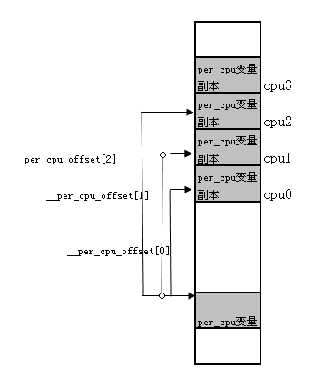

本节介绍了`per-cpu 变量`这个内核基础设施。

<!--more-->


### Linux per-cpu变量介绍
当创建一个`per-CPU`变量时,系统中的每个处理器都会获得它自己对这个变量的拷贝。存取`per-CPU`变量时几乎不需要加锁，**因为每个处理器使用的都是它自己的拷贝**。

`per-cpu`变量可以静态分配，也可以动态分配，下面就分布就这两种分配方法的原理进行简单的介绍。

### 静态分配per-CPU变量

静态`per-CPU`结构设计思路大体可以分为两个阶段：编译阶段和运行时阶段。

在编译阶段，实际上只生成了一个`CPU`样本。系统中所有`per-CPU`结构都放到了一个叫做`.data..percpu`的`section`中，在`include/asm-generic/vmlinux.lds.h`链接脚本中有如下内容：

```c
/*
 * Helper macros to support writing architecture specific
 * linker scripts.
 *
 * A minimal linker scripts has following content:
 * [This is a sample, architectures may have special requiriements]
 *
 * OUTPUT_FORMAT(...)
 * OUTPUT_ARCH(...)
 * ENTRY(...)
 * SECTIONS
 * {
 *      . = START;
 *      __init_begin = .;
 *      HEAD_TEXT_SECTION
 *      INIT_TEXT_SECTION(PAGE_SIZE)
 *      INIT_DATA_SECTION(...)
 *      PERCPU_SECTION(CACHELINE_SIZE)		//请关注这里
 *      __init_end = .;
 *
 *      _stext = .;
 *      TEXT_SECTION = 0
 *      _etext = .;
 *
 *      _sdata = .;
 *      RO_DATA_SECTION(PAGE_SIZE)
 *      RW_DATA_SECTION(...)
 *      _edata = .;
 *
 *      EXCEPTION_TABLE(...)
 *      NOTES
 *
 *      BSS_SECTION(0, 0, 0)
 *      _end = .;
 *
 *      STABS_DEBUG
 *      DWARF_DEBUG
 *
 *      DISCARDS                // must be the last
 * }
 *
 * [__init_begin, __init_end] is the init section that may be freed after init
 * [_stext, _etext] is the text section
 * [_sdata, _edata] is the data section
 *
 * Some of the included output section have their own set of constants.
 * Examples are: [__initramfs_start, __initramfs_end] for initramfs and
 *               [__nosave_begin, __nosave_end] for the nosave data
 */
 
 /**                                                                                                                                      
 * PERCPU_INPUT - the percpu input sections                                                                                              
 * @cacheline: cacheline size                                                                                                            
 *                                                                                                                                       
 * The core percpu section names and core symbols which do not rely                                                                      
 * directly upon load addresses.                                                                                                         
 *                                                                                                                                       
 * @cacheline is used to align subsections to avoid false cacheline                                                                      
 * sharing between subsections for different purposes.                                                                                   
 */                                                                                                                                      
#define PERCPU_INPUT(cacheline)                                         \
        VMLINUX_SYMBOL(__per_cpu_start) = .;                            \
        *(.data..percpu..first)                                         \
        . = ALIGN(PAGE_SIZE);                                           \
        VMLINUX_SYMBOL(__per_cpu_user_mapped_start) = .;                \ 
        *(.data..percpu..user_mapped..page_aligned)                     \
        . = ALIGN(cacheline);                                           \
        *(.data..percpu..user_mapped)                                   \ 
        *(.data..percpu..user_mapped..shared_aligned)                   \ 
        VMLINUX_SYMBOL(__per_cpu_user_mapped_end) = .;                  \
        . = ALIGN(PAGE_SIZE);                                           \
        *(.data..percpu..page_aligned)                                  \ 
        . = ALIGN(cacheline);                                           \
        *(.data..percpu..readmostly)                                    \ 
        . = ALIGN(cacheline);                                           \ 
        *(.data..percpu)                                                \
        *(.data..percpu..shared_aligned)                                \
        VMLINUX_SYMBOL(__per_cpu_end) = .;  
		
/**
 * PERCPU_SECTION - define output section for percpu area, simple version
 * @cacheline: cacheline size
 *
 * Align to PAGE_SIZE and outputs output section for percpu area.  This
 * macro doesn't manipulate @vaddr or @phdr and __per_cpu_load and
 * __per_cpu_start will be identical.
 *
 * This macro is equivalent to ALIGN(PAGE_SIZE); PERCPU_VADDR(@cacheline,,)
 * except that __per_cpu_load is defined as a relative symbol against
 * .data..percpu which is required for relocatable x86_32 configuration.
 */
#define PERCPU_SECTION(cacheline)                                       \
        . = ALIGN(PAGE_SIZE);                                           \
        .data..percpu   : AT(ADDR(.data..percpu) - LOAD_OFFSET) {       \
                VMLINUX_SYMBOL(__per_cpu_load) = .;                     \
                PERCPU_INPUT(cacheline)                                 \
        }
```

由这个链接脚本知道，` .data..percpu` `Section`是处于`init`数据段的，在系统初始化结束后将被回收。那么，系统如何维持`per-CPU`数据呢？这个任务在运行时完成。在系统初始化期间，`start_kernel()`函数中调用`setup_per_cpu_areas（）`函数，用于为每个`cpu`的`per-cpu`变量副本分配空间，该函数会分配 `NR_CPU * （ __per_cpu_end - __per_cpu_start）`大小的内存，然后将 `data..percpu`段中的`CPU原本`拷贝`NR_CPU份`到这块内存中。从此以后系统通过`get_cpu_var`访问`per-CPU变量`的时候就会根据自己的`cpu_id`找到对应的拷贝。

可见，静态`per-CPU`变量的`locality`非常好，`CPU`之间在`Cache`级都不彼此干扰。对于静态生成的`per-CPU`变量需要使用`get_cpu_var`来访问。
 
初始化过程可以用下图说明：
 

 
 
#### 实验示例
 
我们可以使用 `objdump` 可以看到编译 `kernel` 时的 `vmlinux` 文件的 `section`, 例如可以通过如下命令查看`.data..percpu`段的大小：

```bash
~  # objdump -h /usr/lib/debug/lib/modules/`uname -r`/vmlinux | grep -A1 percpu
 18 .data..percpu 00026000  0000000000000000  000000000275b000  01a00000  2**12
                  CONTENTS, ALLOC, LOAD, RELOC, DATA
```

这里可以看到`.data..percpu`段的大小为：`00026000`

这里以`current_task`这个每`CPU`变量为例，通过`crash`，我们可以获得其地址信息：
```
crash> whatis current_task
struct task_struct *current_task;
crash> p current_task
PER-CPU DATA TYPE:
  struct task_struct *current_task;
PER-CPU ADDRESSES:
  [0]: ffff912a5ba15c80
  [1]: ffff912a5ba95c80
  [2]: ffff912a5bb15c80
  [3]: ffff912a5bb95c80
crash> 
crash> p pcpu_base_addr
pcpu_base_addr = $1 = (void *) 0xffff912a5ba00000
crash> p __per_cpu_start
PER-CPU DATA TYPE:
  char __per_cpu_start[];
PER-CPU ADDRESSES:
  [0]: ffff912a5ba00000
  [1]: ffff912a5ba80000
  [2]: ffff912a5bb00000
  [3]: ffff912a5bb80000
crash> 
```
通过如上信息，我们可以看出，内核为`每cpu变量`预留的空间大小为`80000`，远大于`00026000`。
其中`current_task`在该段中的偏移为`15c80`。

#### API

编译期间创建一个per-CPU变量，可以使用宏`DEFINE_PER_CPU`
```
//定义一个变量
DEFINE_PER_CPU(unsigned int, irq_count) __visible = -1;
//定义一个结构体
DEFINE_PER_CPU(struct task_struct *, current_task) = ____cacheline_aligned = &init_task;
//定义一个数组
DEFINE_PER_CPU(int[3],my_percpu_array); 
```

如果只是声明，可以使用宏`DECLARE_PER_CPU`
```
//声明一个变量
DECLARE_PER_CPU(unsigned int, irq_count) __visible = -1;
//声明一个结构体
DECLARE_PER_CPU(struct task_struct *, current_task) = ____cacheline_aligned = &init_task;
//声明一个数组
DECLARE_PER_CPU(int[3],my_percpu_array); 
```

使用静态生成的per-CPU变量：
```
ptr = get_cpu_var(irq_count);
使用ptr
put_cpu_var(irq_count);

//当然，也可以使用下列宏来访问特定CPU上的per-CPU变量
per_cpu(irq_count, cpu_id);/

```
per-CPU变量导出，供模块使用：
```
EXPORT_PER_CPU_SYMBOL(irq_count)
EXPORT_PER_CPU_SYMBOL_GPL(irq_count)
```

### 动态分配per-CPU变量

动态分配per-CPU变量的场景是什么呢？虽然在内核的核心代码中也可以使用动态per-CPU变量，但是主要还是给内核模块使用的。既然是模块，那就有可能在任何时候启动使用，也可能会卸载。动态per-CPU变量就是为了满足这个需要而产生的。

我们不妨思考下，如何能把动态`per-CPU`的`locality`设计得跟静态的一样呢？ 由于不知道系统中将会有多少动态结构出现，所以不宜采用预留内存的方式，这为我们的设计带来了很大挑战。实际上，`Linux`也没有完全解决这个问题，但还是做了最大程度的优化。考虑到`per-CPU`变量的访问模式，效率应该和静态方式不相上下。下面看看`linux`的处理方式。

动态`per-CPU`结构相对于静态结构来说，设计上更直观，但效率上要低一些。每次调用`alloc_percpu(type)`的时候会生成一个维度为`NR_CPUS`的指针数组，每个指针指向一个`kzalloc/kmalloc_node`出来的`type`型对象。`Linux`在这里采取了一个优化手段：如果第`i`个`cpu`在线（`linux`支持`cpu`的`hot-plug`），那么就采用`kmalloc_node`来分配空间，这个空间与`cpu i`的亲和性很高；如果`cpu i`不在线，则采用通用的`kzalloc`分配了。

#### API

分配per-CPU变量:`alloc_percpu`
```
struct mem_cgroup {
	...
	struct mem_cgroup_stat_cpu __percpu *stat_cpu;
	...
}
memcg->stat_cpu = alloc_percpu(struct mem_cgroup_stat_cpu)
```

回收per-CPU变量：`free_percpu`
```
free_percpu(memcg->stat_cpu)
```

### 参考文章

* https://m.zohead.com/archives/linux-kernel-percpu-variable/?wpmp_switcher=true
* https://blog.csdn.net/maray/article/details/5115371
