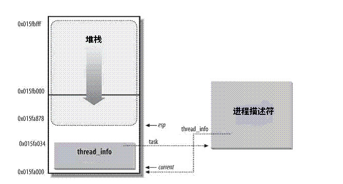

在`linux`系统中，每个进程都会有自己的进程描述符，它用结构体`struct task_struct`来表示，其描述了一个具体进程的所有信息。
本文对**进程描述符**进行了详细的介绍。
<!--more-->

### 进程描述符:task_struct 

`struct task_struct`相对较大，在`64`位系统上，它大约有`4.1KB`。但考虑到该结构体内包含了内核管理一个进程所需的所有信息，那么它的大小也算相当小了。

在内核中，我们需要非常高效的获取进程的`struct task_struct`结构体，在现在的内核版本中，会在内核栈底（对于向下增长的栈来说）创建一个新的结构`struct thread_info`:
```
struct thread_info {
        struct task_struct      *task;          /* main task structure */
        struct exec_domain      *exec_domain;   /* execution domain */
        __u32                   flags;          /* low level flags */
        __u32                   status;         /* thread synchronous flags */
        __u32                   cpu;            /* current CPU */
        int                     preempt_count;  /* 0 => preemptable,
                                                   <0 => BUG */
        mm_segment_t            addr_limit;
        struct restart_block    restart_block;
        void __user             *sysenter_return;
#ifdef CONFIG_X86_32
        unsigned long           previous_esp;   /* ESP of the previous stack in
                                                   case of nested (IRQ) stacks
                                                */
        __u8                    supervisor_stack[0];
#endif
        unsigned int            sig_on_uaccess_error:1;
        unsigned int            uaccess_err:1;  /* uaccess failed */
};
```

该结构体中的`task`域中存放着指向该任务实际`task_struct`的指针。而`struct task_struct`中的`stack`域指向了该进程的内核栈的栈底（对于向下增长的栈来说）。

`task_struct`和内核栈的关系如下图所示：


在`x86-64`位系统上，进程内核栈的大小为`16KB`，用如下数据结构表示：

```c
union thread_union { 
        struct thread_info thread_info;
        unsigned long stack[THREAD_SIZE/sizeof(long)];  
}; 
```

我们可以使用`crash`工具查看`struct task_struct`的`stack`域和进程`thread_info`的关系，这里我查看了系统上`init`进程（进程号为`1`）的信息：

```c
crash> union thread_union
union thread_union {
    struct thread_info thread_info;
    unsigned long stack[2048];
}
SIZE: 16384  //这里可以看出内核栈大小为16KB。
crash> task -R stack 1
PID: 1      TASK: ffff95c499450000  CPU: 1   COMMAND: "systemd"
  stack = 0xffff95c49944c000, 
crash> thread_info.task 0xffff95c49944c000
  task = 0xffff95c499450000
```
