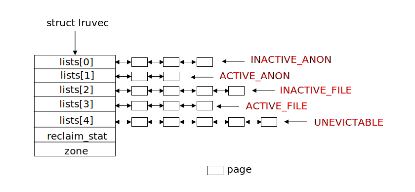
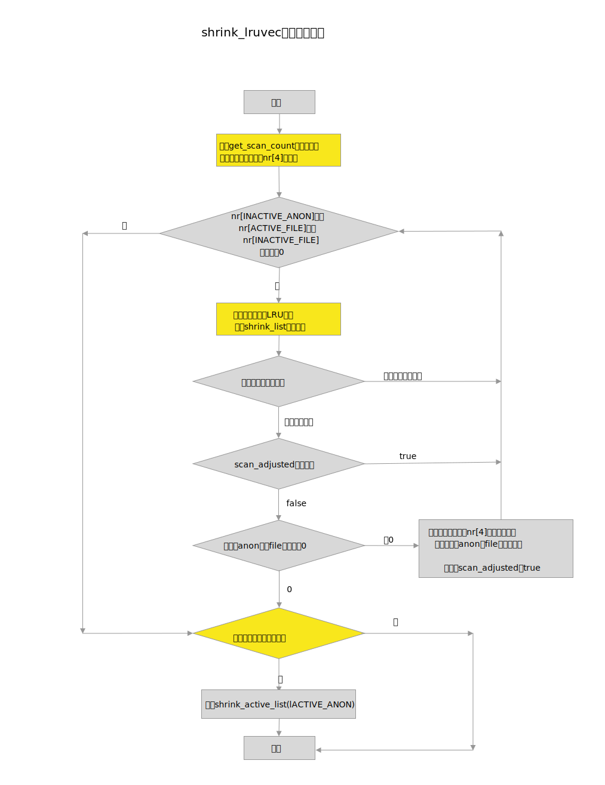

`Linux`内存回收操作的核心就是扫描`LRU`链表，完成该工作的函数名称为`shrink_lruvec`，本文首先介绍了`LRU`链表，然后详细分析了`shrink_lruvec`函数。

<!--more-->


### 系统环境

* 发行版：`centos7.5`
* 内核版本：[3.10.0-862.14.4.el7.x86_64](http://vault.centos.org/7.5.1804/updates/Source/SPackages/kernel-3.10.0-862.14.4.el7.src.rpm)
* 处理器：`40core（Intel(R) Xeon(R) CPU E5-2630 v4 @ 2.20GHz）`
* 内存：`128GB`，两个`NUMA node`


### LRU链表

`LRU`的缩写是`Least Recently Used`（最近最少使用），`LRU`基于局部性原理，假设最近不使用的页面再较短时间内也不会被频繁使用。当内存不足时，这些页面将成为被换出的候选者。内核使用双向链表定义`LRU`链表，并且根据页面类型，分为`LRU_FILE`和`LRU_ANON`，每种类型又根据页面是否活跃分为`active  LRU`和`inactive  LRU`，所以内核一共有**5个LRU**链表：

* 不活跃的匿名页面链表：`LRU_INACTIVE_ANON`
* 活跃的匿名页面链表：`LRU_ACTIVE_ANON`
* 不活跃的文件页面链表：`LRU_INACTIVE_FILE`
* 活跃的文件页面链表：`LRU_ACTIVE_FILE`
* 不可回收的页面链表：`LRU_UNEVICTABLE`

`LRU`之所以要分成这样，是因为当系统上内存紧张时，总是优先换出`page cache`页面，而不是匿名页面。因为大多数情况下`page cache`页面不需要回写磁盘，除非页面内容被修改了，而匿名页面总是要被写入交换分区才能被换出。

在我所分析的系统内核版本上，`LRU`链表是按照`zone`来配置的，也就是说每个`zone`中都有一整套`LRU`链表，因此数据结构`zone`中有一个数据成员`lruvec`指向这个链表。枚举类型变量`lru_list`列举了上述各种类型的链表。

```c
#define LRU_BASE 0
#define LRU_ACTIVE 1
#define LRU_FILE 2

enum lru_list {
        LRU_INACTIVE_ANON = LRU_BASE,
        LRU_ACTIVE_ANON = LRU_BASE + LRU_ACTIVE,
        LRU_INACTIVE_FILE = LRU_BASE + LRU_FILE,
        LRU_ACTIVE_FILE = LRU_BASE + LRU_FILE + LRU_ACTIVE,
        LRU_UNEVICTABLE,
        NR_LRU_LISTS
};

struct lruvec {
        struct list_head lists[NR_LRU_LISTS];
        struct zone_reclaim_stat reclaim_stat;
#ifdef CONFIG_MEMCG
        struct zone *zone;
#endif
};

struct zone {
	...
	spinlock_t              lru_lock;
	struct lruvec           lruvec;
	...
};
```

在现在的服务器系统上，一般都打开了`CONFIG_MEMCG`配置选项，有了这个选项后，`zone`中的`lruvec`指向的链表一般为空，系统会为每个`memory cgroup` 分配一个`lruvec`，也就是说系统上有多少个`memory cgroup`，就会有多少套`LRU`链表。`LRU`的一套链表示意如下：




内存回收操作的核心就是扫描`LRU`链表，换成合适的页面，从而达到释放内存的目的。而操作`LRU`链表的核心函数为`shrink_lruvec`，接着我们就分析一下这个函数。


### shrink_lruvec

该函数是一个用于释放一个内存区域`zone`（或者一个`memory cgroup`）中最近最少使用的`page`。其原型如下：

```c
void shrink_lruvec(struct lruvec *lruvec, struct scan_control *sc)
```

* 第一个参数`lruvec`就存放了需要扫描的`LRU`链表
* 第二个参数`sc`是用于控制页面回收的行为

`lruvec`数据结构在上一节已经介绍了，下面先介绍一下`scan_control`这个数据结构：

```c
struct scan_control {
        /* Incremented by the number of inactive pages that were scanned */
        unsigned long nr_scanned;

        /* Number of pages freed so far during a call to shrink_zones() */
        unsigned long nr_reclaimed;

        /* How many pages shrink_list() should reclaim */
        unsigned long nr_to_reclaim;

        unsigned long hibernation_mode;

        /* This context's GFP mask */
        gfp_t gfp_mask;

        int may_writepage;

        /* Can mapped pages be reclaimed? */
        int may_unmap;

        /* Can pages be swapped as part of reclaim? */
        int may_swap;

        /* Cgroups are not reclaimed below their configured memory.low,
         * unless we threaten to OOM. If any cgroups are skipped due to
         * memory.low and nothing was reclaimed, go back for memory.low
         */
        int may_thrash;
        int memcg_low_reclaim;
        int memcg_low_skipped;

        int order;

        /* Scan (total_size >> priority) pages at once */
        int priority;

        /*
         * The memory cgroup that hit its limit and as a result is the
         * primary target of this reclaim invocation.
         */
        struct mem_cgroup *target_mem_cgroup;

        /*
         * Nodemask of nodes allowed by the caller. If NULL, all nodes
         * are scanned.
         */
        nodemask_t      *nodemask;
};
```

关键成员如下：

* `nr_scanned`： 用于返回一次回收操作共扫描的页面数量
* `nr_reclaimed`：用于返回一次回收操作共回收的页面数量
* `nr_to_reclaim`： 要回收的页面数量
* `may_writepage`：用于控制回收过程是否可以回写磁盘
* `may_unmap`：用于控制回收过程是否可以unmap
* `may_swap`：用于控制回收过程是否可以回收匿名页面
* `priority`： 扫描LRU链表的优先级，其用于计算每次扫描页面的数量，计算方法是`total_size >> priority`，初始值为`12`，依次递减，`priority`数值越低，扫描的页面数量越大，相当于逐步加大扫描粒度。
* `order`：分配的阶数（`2^order`个页面）
* `gfp_mask`：分配掩码
* `target_mem_cgroup`： 主要回收的`mem cgroup`

`shrink_lruvec`函数的执行流程如下图：



这里稍微解释一下`scan_adjusted`变量控制的逻辑。当进行全局直接回收内存时，且优先级为`12`（`DEF_PRIORITY`）时，设置`scan_adjusted`为`true`。此时，一般说明系统稍微有点内存压力，且`kswapd`还没有被激活，所以最好一次性回收尽可能多的页面，免得后续再激活`kswapd`内核线程。因此即使已经回收够了足够的页面，还是要继续扫描页面，直到`nr`数组降到`0`为止。

上图中提到的**活跃页面是否过少**，在后续的`shrink_list`函数分析中会详细分析。


### get_scan_count

`shrink_lruvec`会调用`get_scan_count`函数，它根据`swapiness`和`priority`优先级计算`4`个`LRU`链表中需要扫描的页面的个数，结构放到`nr`数组中。

函数原型如下：

```c
static void get_scan_count(struct lruvec *lruvec, struct scan_control *sc, unsigned long *nr);
```

* `nr[0]`: 存放要扫描的不活跃的匿名页面个数
* `nr[1]`:  存放要扫描的活跃的匿名页面个数
* `nr[2]`: 存放要扫描的不活跃的文件页面个数
* `nr[3]`: 存放要扫描的活跃的文件页面个数

该函数的扫描规则总结如下：

* 如果系统上没有交换分区或者`swap`空间，则只扫描文件页面。
* 如果不是全局回收，且`swappiness`为0，则只扫描文件页面；
* 如果是全局回收，且`zone`中空闲页面个数+文件页面个数小于等于高水位，那么只扫描匿名页面（说明此时该`zone`中主要是匿名页面） 
* 如果`LRU_INACTIVE_FILE > LRU_ACTIVE_FILE`，那么只扫描文件映射页面
* 如果系统压力巨大（`priority`为`0`）时，且`swappiness`不为`0`，则`anon`和`file`也都会扫描
* 其它情况下，`anon`和`file`也都要扫描

扫描页面多少的计算公式如下：

```
//扫描一种页面
scan = LRU上总页面数 >> sc->priority;
//同时扫描两种页面
scan = LRU上总页面数 >> sc->priority;
ap = swappiness* (recent_scanned[0] + 1)/ (recent_rotated[0] + 1)
ap = (200 - swappiness)* (recent_scanned[1] + 1)/ (recent_rotated[1] + 1)
scan_anon = scan * ap / (ap + fp + 1)
scan_file = scan * fp / (ap + fp + 1)
```


* `recent_scanned`: 指最近扫描的页面数量，在扫描活跃链表和不活跃链表时，会统计到`recent_scanned` 变量中。
* `recent_rotated`：
	* 扫描不活跃链表时，统计那些被重新移动到活跃链表中的页面数量到`recent_rotated`变量中
	* 扫描活跃链表时，访问引用的页面页被统计到`recent_rotated`变量中

代码中使用如下结构体描述这两个变量：

```c
struct zone_reclaim_stat {
        /*   
         * The pageout code in vmscan.c keeps track of how many of the
         * mem/swap backed and file backed pages are referenced.
         * The higher the rotated/scanned ratio, the more valuable
         * that cache is.
         *
         * The anon LRU stats live in [0], file LRU stats in [1]
         */
        unsigned long           recent_rotated[2];
        unsigned long           recent_scanned[2];
};
```

其中匿名页面放到数组`0`中，文件页面放到数组`1`中，`recent_rotated/recent_scanned`的比值越大，说明这些被缓存起来的页面价值越大，他们更应该留下来。

举个例子，如果`recent_rotated[1]/recent_scanned[1]`越小，说明`LRU`中的文件页面价值较小，那么更应该多扫描一些文件页面，尽量把没有价值的文件页面释放掉。根据公式，文件页面的`recent_rotated`越小，`fp`值越大，那么最后扫描的`scan_file`需要扫描的文件页面数量也就越大。也可以理解为：在扫描总量一定的情况下，扫描文件页面的比重更大。


### shrink_list

下面来看看`shrink_list`函数，该函数处理各个LRU链表的回收页面工作：

```c?linenums
static unsigned long shrink_list(enum lru_list lru, unsigned long nr_to_scan,
                                 struct lruvec *lruvec, struct scan_control *sc) 
{
        if (is_active_lru(lru)) { 
                if (inactive_list_is_low(lruvec, lru)) 
                        shrink_active_list(nr_to_scan, lruvec, sc, lru);
                return 0;
        }

        return shrink_inactive_list(nr_to_scan, lruvec, sc, lru);  
}
```

* 第`4-8`行代码处理活跃的`LRU`链表的，包括匿名页面和文件页面，只有当不活跃的页面少于活跃页面，才需要调用`shrink_active_list`来看哪些活跃页面可以迁移到不活跃链表中
* 第`10`行代码调用`shrink_inactive_list`扫描不活跃页面链表，并回收页面，后续会详细介绍该函数。

这里遇到了一个文件，如果判断**不活跃的页面少于活跃页面**，前面在分析`shrink_lruvec`函数时也遇到了该文件，这里就详细分析一下：

### inactive_list_is_low


`inactive_list_is_low`的判断逻辑区分匿名页面和文件缓存两种情况，我们分别就这两种情况进行讨论。

#### 文件页面

对于文件页面非常简单，直接判断不活跃的文件页面是否小于活跃的文件页面个数。

```c
static int inactive_file_is_low(struct lruvec *lruvec)
{
        unsigned long inactive;
        unsigned long active;

        inactive = get_lru_size(lruvec, LRU_INACTIVE_FILE);
        active = get_lru_size(lruvec, LRU_ACTIVE_FILE);

        return active > inactive;
}
```

#### 匿名页面

对于匿名也没稍微复杂一些，在判断时有一个`inactive_ratio`变量，对于内存空间小于`1GB`的情况，`inactive_ratio`等于`1`，`1GB`到`10GB`的情况，`inactive_ratio`等于`3`。`inactive_ratio`为`3`，表明`LRU`中活跃匿名页面和不活跃匿名页面的比值为`3：1`，也就是说在理想情况下，有`25%`的匿名页面保存链表中。

```c
static int inactive_anon_is_low_global(struct zone *zone)
{
        unsigned long active, inactive;

        active = zone_page_state(zone, NR_ACTIVE_ANON);
        inactive = zone_page_state(zone, NR_INACTIVE_ANON);

        if (inactive * zone->inactive_ratio < active)
                return 1;

        return 0;
}
```
所以判断方法如下：

```
inactive * inactive_ratio < active
```


`inactive_ratio`变量的计算又分为两种情况下：

* 对于全局的`LRU`链表，使用的`zone`数据结构中的`inactive_ratio`变量，该变量的值在`zone`初始化时就计算好了。
* 对于`mem cgroup`中的`LRU`链表，`inactive_ratio` 需要根据`mem cgroup`中的页面总数进行计算。

具体计算方法如下：

```
/*
 * total     target    max
 * memory    ratio     inactive anon
 * -------------------------------------
 *   10MB       1         5MB
 *  100MB       1        50MB
 *    1GB       3       250MB
 *   10GB      10       0.9GB
 *  100GB      31         3GB
 *    1TB     101        10GB
 *   10TB     320        32GB
 */
 
 gb = zone的内存大小或者mem cgoup中的页面的总大小（单位为GB）
 gb 大于等于1时： inactive_ratio = int_sqrt(10 * gb)
 gb 小于1时，inactive_ratio = 1
```
