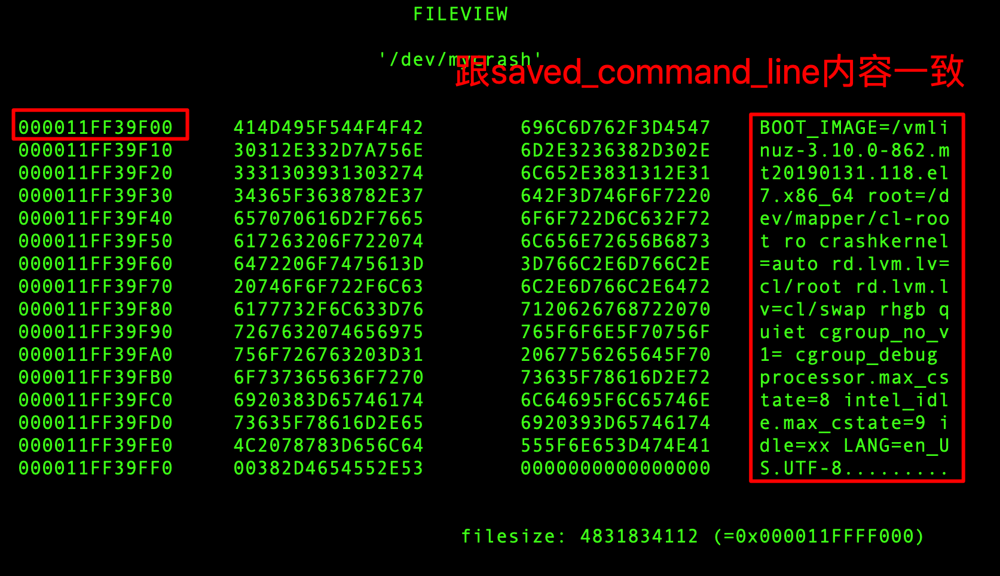

用户态的程序都是在内存保护模式下使用内存，无法直接访问物理内存。同时用户程序使用的地址都是逻辑地址，而不是物理地址。这些逻辑地址对应的物理内存在哪里，用户进程本身并不知道。

如果用户程序想要访问物理内存，就需要通过内核实现。本文介绍基于内存模块的方式，实现`Linux`中用户态程序访问所有物理内存。

<!--more-->


### 系统环境

* 发行版：`centos7.5 `（Virtual Box虚拟机）
* 内核版本：[3.10.0-862.14.4.el7.x86_64](http://vault.centos.org/7.5.1804/updates/Source/SPackages/kernel-3.10.0-862.14.4.el7.src.rpm)
* 处理器：`Intel(R) Core(TM) i7-4770HQ CPU @ 2.20GHz`
* 内存：`4GB`

### 内核模块的编写

在[3.10.0-862.14.4.el7.x86_64](http://vault.centos.org/7.5.1804/updates/Source/SPackages/kernel-3.10.0-862.14.4.el7.src.rpm)版本的内核上，其实已经有相关模块（内核代码）实现了用户程序访问物理内存的功能，其提供的接口包括如下几个：

* /dev/mem
* /dev/crash

这些模块的实现原理都类似：通过文件读写的方法，实现物理内存地址的访问。将物理地址，作为参数`poff`传递。

```c
static ssize_t  crash_read(struct file *file, char *buf, size_t count, loff_t *poff) ;
```
在内核代码中，是无法直接访问物理地址的，代码能访问的都是逻辑地址。此时我们需要先将物理地址转换成逻辑地址，才能在代码中对地址读写。

物理地址转换成逻辑地址方法`map_virtual`的原理：

（1）根据物理地址，计算出对应的页面号
```c
pfn = (unsigned long)(poff >> PAGE_SHIFT); 
```
（2）将页面号找到对应的页面指针
```c
page = pfn_to_page(pfn); 
```
（3）通过`kmap`映射成逻辑地址
```c
vaddr = kmap(page); 
```

基于以上原理，本文实现了一个内核模块`my_crash.ko`，插入模块后，系统上会创建一个设备文件`/dev/mycrash`

```
# insmod my_crash.ko 
# ls -l /dev/mycrash 
crw------- 1 root root 10, 58 Feb 10 09:52 /dev/mycrash
```

> 注意：`/dev/mycrash`是在`/dev/crash`的基础上修改而来的，因为`/dev/crash`中没有考虑整个系统的物理地址大小，其`crash_llseek`实现也不满足需求。


### 物理内存数据查看

这里我们就是用了[http://ilinuxkernel.com/?p=1248](http://ilinuxkernel.com/?p=1248)中提到的`fileview`工具来查看物理内存中的实际数据，物理地址可以手工输入。


#### fileview工具简要用法

* 输入回车键，接着出现`Address`提示，可以输入要查看的物理地址，然后回车键确认，即可查看物理内存的信息。
* `Q`和`q`： 以8字节显示结果
* `W`和`w`： 以2字节显示结果
* `D`和`d`： 以4字节显示结果
* `B`和`b`： 以1字节显示结果
* `ESC`: 退出程序

#### 查看物理内存示例

我们通过`crash`寻找一个内核变量的物理地址：
```
crash> p saved_command_line
saved_command_line = $3 = 0xffff989d5ff39f00 "BOOT_IMAGE=/vmlinuz-3.10.0-862.mt20190131.118.el7.x86_64 root=/dev/mapper/cl-root ro crashkernel=auto rd.lvm.lv=cl/root rd.lvm.lv=cl/swap rhgb quiet cgroup_no_v1= cgroup_debug processor.max_cstate=8 intel_idle.max_cstate=9 idle=xx LANG=en_US.UTF-8"
crash> vtop 0xffff989d5ff39f00
VIRTUAL           PHYSICAL        
ffff989d5ff39f00  11ff39f00       

PGD DIRECTORY: ffffffff9c40e000
PAGE DIRECTORY: bae3a067
   PUD: bae3a3a8 => bae3e067
   PMD: bae3e7f8 => 800000011fe000e3
  PAGE: 11fe00000  (2MB)

      PTE         PHYSICAL   FLAGS
800000011fe000e3  11fe00000  (PRESENT|RW|ACCESSED|DIRTY|PSE|NX)

      PAGE       PHYSICAL      MAPPING       INDEX CNT FLAGS
fffff57e847fce40 11ff39000                0        0  1 2fffff00000400 reserved
```

`saved_command_line`变量的物理地址是`11ff39f00`，我们通过`fileview查看一下，看物理内存上的信息是否正确：



### 代码

本文中的模块和`fileview`代码：[access_physical_memory.tar.gz](./access_physical_memory.tar.gz)

### 参考文章

* http://ilinuxkernel.com/?p=1248
