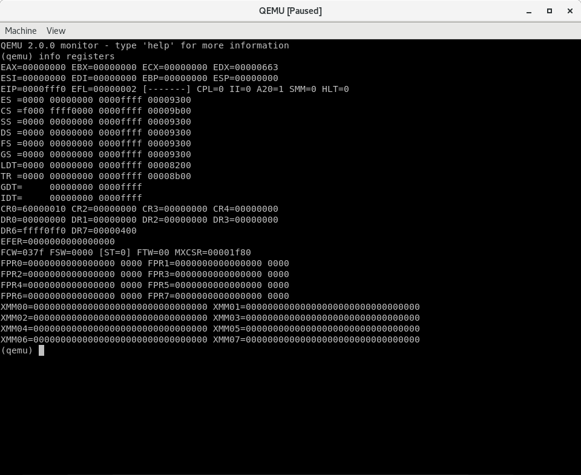

通常计算机的启动方式有两种，传统的`BIOS-MBR`启动模式和新的`UEFI-GPT`启动模式，本文将介绍传统的`BIOS-MBR`启动模式。

<!--more-->

### intel 80386计算机加电时，寄存器的值

首先，我们看一下按下计算机的电源或者复位键之后`CPU`中寄存器的初始值。


我们需要重点关注一下`cs`寄存器和`eip`寄存器，初始化状态的`CS`和`EIP`确定了处理器的初始执行地址，此时`CS`中可见部分-选择子（`selector`）的值为`0xF000`，而其不可见部分-基地址（`base`）的值为`0xFFFF0000`；EIP的值是`0xFFF0`，这样实际的线性地址（由于没有启动页机制，所以线性地址就是物理地址）为`CS.base+EIP=0xFFFFFFF0`。在`0xFFFFFFF0`这里只是存放了一条跳转指令，通过跳转指令跳到`BIOS`例行程序起始点。

在这里我们先暂停，做个简单的实验，用硬件模拟机器`qemu`来进一步认识上述结果。

### 实验1：通过qemu了解Intel 80386启动后的CS和EIP值，并分析第一条指令的内容

1)  首先，启动qemu并让其停到执行第一条指令前，这需要增加一个参数"-S", 如下：

```
qemu-system-i386 -S
```

* `-S` 参数告诉虚拟机启动后先不运行。

这时`qemu`会弹出一个没有任何显示内容的图形窗口，显示如下：


2) 然后通过按`Ctrl+Alt+2`进入`qemu`的`monitor`界面，为了了解`80386`此时的寄存器内容，在`monitor`界面下输入命令`info registers`



我们可以看到`EIP=0xfff0`，`CS`的`selector=0xf000`，`CS`的`base=0xfff0000`。

### intel 80386计算机启动流程

由上节我们知道，`intel 80386`计算机加电后，执行的第一条指令的位置是：`0xFFFFFFF0`，该位置其实是`BIOS`程序，它做完计算机硬件自检和初始化后，会选择一个启动设备（例如软盘、硬盘、光盘等），并且读取该设备的第一扇区(即主引导扇区或启动扇区)到内存一个特定的地址`0x7c00`处，然后`CPU`控制权会转移到那个地址继续执行。

其实，了解了如上信息，就足够了，着急的读者可以直接跳到下一节。不过我还是想详细介绍了计算机的启动流程。

当计算机上电初始化时，物理内存被设置成从地址`0`开始的连续区域。除了地址从`0xA0000`到`0xFFFFF`(`640K`到`1M`共`384K`)和`0xFFFE0000`到`0xFFFFFFFF`(`4G`处的最后`64K`)范围以外的所有内存都可用作**系统内存**。这两个特定范围被用于`I/O`设备和`BIOS`程序。`640K–1M`之间的`384K`用作下图中指明的用途。其中地址`0xA0000`开始的`128K`用作显存缓冲区，随后部分用于其他控制卡的`ROM BIOS`或其映射区域，而`0xF0000`到`1M`范围用于高端系统`ROM BIOS`的映射区。


`ROM-BIOS`是一段固化在主板上的程序，这段程序在计算机加电后会自动被加载到内存中，主要用于计算机的自检和初始化。根据上面的分析可知`0xFFFFFFF0`正好处于这段程序中，位于`4G`空间最后一个`64K`的最后`16`字节处。这里会被安排一条`ljmp`指令，用于跳转到`BIOS`代码中`64KB`范围内的某一条指令开始执行。`BIOS`在执行了一系列硬件检测和初始化操作之后，会把与原来`PC`机兼容的`64KB BIOS`代码和数据复制到内存低端`1M`末端的`64K`处，然后跳转到这个地方并让`CPU`运行在实地址模式下。过程如下图所示。


最后，如果硬盘或软盘是首选的启动设备的话，`BIOS`会读取其中的`0`柱面`0`磁道`1`扇区，并检测是否为可引导设备，如果是的话，这个扇区将被加载到内存`0x7c00`处并被执行。可引导的标志是扇区的最后两个字节为`0x55`和`0xAA`。

### 引导扇区

上面提到，`BIOS`程序完成计算机硬件的自检和初始化后，会选择一个启动设备，并读取该设备的第一个扇区到特定的地址`0x7c00`处，然后将`CPU`控制权转移到那个地址继续执行。

其实引导扇区是有规范的，如果不符合规范，`BIOS`程序会提示找不到启动磁盘的。下面我们就演示一下。

首先我们创建一个空的磁盘映像文件，使用`dd`命令。

```
# dd if=/dev/zero of=disk0.img bs=1024 count=200
```

上面我们创建了一个`200KB`大的硬盘映像。

查看一下硬盘映像中的内容。因为我们在创建时输入使用的是产生`0`的设备文件，所以现在的这块**硬盘**中的内容全部为零，为了加深印象我们还是查看一下。

```
# xxd -a disk0.img 
00000000: 0000 0000 0000 0000 0000 0000 0000 0000  ................
*
00031ff0: 0000 0000 0000 0000 0000 0000 0000 0000  ................
```

可以看到`disk0.img`中的内容全为零。

下面我们试试看如果直接用虚拟机去启动这块硬盘的话会发生什么。

```
# qemu-system-i386 disk0.img
```
虚拟机启动后结果如下，`Boot failed: not a bootable disk`。提示磁盘不可引导。


我们将`disk0.img`复制一份，命名为`disk1.img`，现在将`disk1.img`文件的第`510`、`511`字节改为`0x55`、`0xAA`，然后重新启动看看结果。

这里我们使用`hexedit`这个工具，对`disk1.img`进行编辑。

```
# cp disk0.img disk1.img
# hexedit disk1.img
```

通过键盘方向键定位到位置`0x1FE`即十进制`510`这个位置，将连续的两个字节分别修改为`0x55`、`0xAA`，`Ctrl + X`保存退出。


再次查看，可以看出已经有了我们需要的可引导标记。

```
# xxd -a disk1.img 
00000000: 0000 0000 0000 0000 0000 0000 0000 0000  ................
*
000001f0: 0000 0000 0000 0000 0000 0000 0000 55aa  ..............U.
00000200: 0000 0000 0000 0000 0000 0000 0000 0000  ................
*
00031ff0: 0000 0000 0000 0000 0000 0000 0000 0000  ................
```

我们再次尝试启动虚拟机，看看这次的结果。

```
# qemu-system-i386 disk1.img
```


如我们所愿，虚拟机这次告诉我们已经从硬盘开始引导了。但是我们的硬盘里一行指令也没有，所以现在虚拟机就傻傻的在那里等着。

### 小工具

本节介绍一个小工具，用于生成合法的主引导记录，也就是磁盘的`0`柱面`0`磁道`1`扇区，即对磁盘映像文件的前`512`个字节设置为可引导的。

程序的功能如下：

1. 读入一个不大于`510`字节的文件
2. 将它补齐到`510`字节
3. 将第`510`、`511`字节(从`0`开始计数)设置为`0x55`、`0xAA`
4. 写入新的文件


程序的代码如下：

```c
// copy form: https://github.com/chyyuu/os_kernel_lab/blob/master/labcodes/lab1/tools/sign.c
#include <stdio.h>
#include <errno.h>
#include <string.h>
#include <sys/stat.h>

int
main(int argc, char *argv[]) {
    struct stat st;
    if (argc != 3) {
        fprintf(stderr, "Usage: <input filename> <output filename>\n");
        return -1;
    }
    if (stat(argv[1], &st) != 0) {
        fprintf(stderr, "Error opening file '%s': %s\n", argv[1], strerror(errno));
        return -1;
    }
    printf("'%s' size: %lld bytes\n", argv[1], (long long)st.st_size);
    if (st.st_size > 510) {
        fprintf(stderr, "%lld >> 510!!\n", (long long)st.st_size);
        return -1;
    }
    char buf[512];
    memset(buf, 0, sizeof(buf));
    FILE *ifp = fopen(argv[1], "rb");
    int size = fread(buf, 1, st.st_size, ifp);
    if (size != st.st_size) {
        fprintf(stderr, "read '%s' error, size is %d.\n", argv[1], size);
        return -1;
    }
    fclose(ifp);
    buf[510] = 0x55;
    buf[511] = 0xAA;
    FILE *ofp = fopen(argv[2], "wb+");
    size = fwrite(buf, 1, 512, ofp);
    if (size != 512) {
        fprintf(stderr, "write '%s' error, size is %d.\n", argv[2], size);
        return -1;
    }
    fclose(ofp);
    printf("build 512 bytes boot sector: '%s' success!\n", argv[2]);
    return 0;
}

```

编译连接

```
# gcc -o sign sign.c
```

创建一个小文件（小于`510`字节），并查看：

```
# echo "Hello, World." > boot
# xxd -a boot 
00000000: 4865 6c6c 6f2c 2057 6f72 6c64 2e0a       Hello, World..
```

接下来用我们的工具处理一下这个文件：
```
# ./sign boot boot.img
'boot' size: 14 bytes
build 512 bytes boot sector: 'boot.img' success!
```

查看生成的文件`boot.img`, 此时生成的文件已经是`512`字节了。

```
# xxd -a boot.img 
00000000: 4865 6c6c 6f2c 2057 6f72 6c64 2e0a 0000  Hello, World....
00000010: 0000 0000 0000 0000 0000 0000 0000 0000  ................
*
000001f0: 0000 0000 0000 0000 0000 0000 0000 55aa  ..............U.
```

用虚拟机从这个磁盘映像文件启动：
```
# qemu-system-i386 boot.img
```


结果和之前使用`hexedit`手动编辑是一样的，引导成功。

### 进一步debug BIOS的启动过程

上面提到，计算机加电后，执行的第一条指令的位置是：`0xFFFFFFF0`，实际上，该位置是一个**跳转指令**，跳到`BIOS`程序完成计算机硬件自检和初始化，最后读取启动设备的第一个扇区内容到`0x7c00`处，下面我们通过`qemu`来验证一下这些内容。

首先我们通过上面的小工具制作一个合法的引导扇区。我们在扇区的开头的位置，写入字符串`Hello，World!`，然后通过`sign`工具，将第`510`、`511`字节(从`0`开始计数)设置为`0x55`、`0xAA`。命令如下：

```
# echo "Hello,World!" > boot.bin
# ./sign boot.bin boot.img
```
查看其内容如下：
```
# xxd -a boot.img 
00000000: 4865 6c6c 6f2c 576f 726c 6421 0a00 0000  Hello,World!....
00000010: 0000 0000 0000 0000 0000 0000 0000 0000  ................
*
000001f0: 0000 0000 0000 0000 0000 0000 0000 55aa  ..............U.
```

用虚拟机从这个磁盘映像文件启动：

```
qemu-system-i386 boot.img -S -s
```

* `-S` 参数告诉虚拟机启动后先不运行。
* `-s` 参数告诉虚拟机开启一个`GDB`服务器等待客户端的连接，服务默认监听`TCP`端口`1234`。

在另外一个终端中，启动`GDB`：
```
# gdb -q
(gdb) 
```

* `-q`: 参数表示静默启动，不显示版本信息。

连接到目标服务器：

```
(gdb) target remote localhost:1234
Remote debugging using localhost:1234
0x0000fff0 in ?? ()
(gdb) 

```

设置`CPU`架构为`i8086`，因为最开始的这段代码运行在`16`位实地址模式：

```
(gdb) set architecture i8086
warning: A handler for the OS ABI "GNU/Linux" is not built into this configuration
of GDB.  Attempting to continue with the default i8086 settings.

The target architecture is assumed to be i8086
(gdb) 
```

设置当程序停住或单步调试时自动显示指令：

```
(gdb) display/i $cs*16+$pc
1: x/i $cs*16+$pc
   0xffff0:	ljmp   $0xf000,$0xe05b
(gdb) 
```

从上面可以看出，`$cs*16+$pc`就是计算机加电时的开始执行的地址，该位置时一条`ljmp`指令，跳转到`BIOS`程序中进行初始化，然后会读取引导扇区到内存一个特定的地址`0x7c00`处，`CPU`控制权会转移到那个地址继续执行。

接下来，我们在`0x7c00`处设置一个断点：
```
(gdb) b *0x7c00
Breakpoint 1 at 0x7c00
```
输入`c`使虚拟机恢复运行：
```
(gdb) c
Continuing.

Breakpoint 1, 0x00007c00 in ?? ()
1: x/i $cs*16+$pc
=> 0x7c00:	dec    %ax
```

查看`0x7c00`处的内容：
```
(gdb) x/16xb 0x7c00
0x7c00:	0x48	0x65	0x6c	0x6c	0x6f	0x2c	0x57	0x6f
0x7c08:	0x72	0x6c	0x64	0x21	0x0a	0x00	0x00	0x00
```

上面`GDB`的输出，正是引导分区开头处的内容，即字符串`Hello，World!`。


### 总结

本文介绍了`Intel 80386`加电后的启动过程，并结合`qemu`分析验证了所学到的知识，为后续开启操作系统的学习打下基础。

### 参考文章

* [汇编语言一发入魂-0x00-计算机是如何启动的](https://kviccn.github.io/posts/2020/02/%E6%B1%87%E7%BC%96%E8%AF%AD%E8%A8%80%E4%B8%80%E5%8F%91%E5%85%A5%E9%AD%82-0x00-%E8%AE%A1%E7%AE%97%E6%9C%BA%E6%98%AF%E5%A6%82%E4%BD%95%E5%90%AF%E5%8A%A8%E7%9A%84/)
* [Intel 80386加电后启动过程](https://chyyuu.gitbooks.io/simple_os_book/content/zh/chapter-1/poweron.html)
