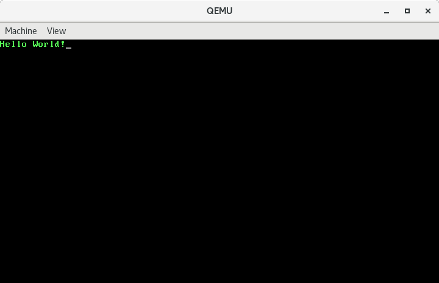

前面文章中介绍了如何控制屏幕光标，如何从硬盘读取数据。这种常用的功能，我们希望将其封装成过程调用，类似于高级语言中的函数，这样当我们需要控制光标或者从硬盘读数据时，就不用写大段的重复代码了。

<!--more-->

在`CPU`中，执行的指令通过`cs:ip`来确定。过程调用实际上就是通过`call`或`lcall`指令来修改`ip`或`cs:ip`来达到跳转到另一段指令中执行的目的。

`call`指令通过修改`ip`来实现过程调用，因为只修改`ip`，所以被调例程与原例程在同一个代码段内，也称为近调用。处理器在执行`call`指令时先将`call`后面的第一条指令的偏移地址压栈，再通过操作数计算出新的`ip`替换当前`ip`。

`lcall`指令通过修改`cs:ip`来实现过程调用，因为同时修改`cs`和`ip`，所以被调例程与原例程不在同一个代码段内，也称为远调用。处理器在执行`lcall`指令时先将`cs、ip`依次压栈，再用指令中给出的段地址代替`cs`原有的内容，用指令中给出的偏移地址代替`ip`原有的内容。

从子例程返回到原例程使用`ret`或`lret`指令。`ret`指令用栈中的数据修改`ip`的内容，实现近转移；`lret`用栈中的数据修改`cs:ip`，实现远转移。`CPU`执行`ret`指令时相当于执行`pop ip`，执行`lret`指令时相当于执行`pop ip`、`pop cs`。

下面我们通过一些简单的例子来学习一下如何使用这些指令。

## call-ret 示例

代码如下：
```asm
# 告诉编译器以16位模式编译，因为BIOS在加载并运行我们的代码时是处于16位实地址模式的
.code16

	movw	$0x7c00, %sp	# 设置堆栈栈顶指针。因为call指令和ret指令的执行依赖于堆栈。
	callw	put_char_A

	jmp	.

 
put_char_A:
	movw	$0xb800, %ax
	movw	%ax, %es
	movw	$'A' | 0x0a00, %es:0
	retw				# 使用ret指令跳回原来的执行流程。

	# .org伪指令指示编译器把位置计数器移动到操作数所指定的位置，这里是将位置计数器移动到510处
	.org	510
	# .word伪指令指示编译器在当前位置写入一个字大小的数据
	.word	0xaa55
```

### 编译、反编译

```
# as --32 boot.s -o boot.o
# objcopy -O binary -j .text boot.o boot.bin
# objdump -D -b binary -m i386 -Mi8086,suffix boot.bin  > boot.asm
# cat boot.asm 

boot.bin:     file format binary


Disassembly of section .data:

00000000 <.data>:
   0:	bc 00 7c             	movw   $0x7c00,%sp
   3:	e8 02 00             	callw  0x8
   6:	eb fe                	jmp    0x6
   8:	b8 00 b8             	movw   $0xb800,%ax
   b:	8e c0                	movw   %ax,%es
   d:	26 c7 06 00 00 41 0a 	movw   $0xa41,%es:0x0
  14:	c3                   	retw   
	...
 1fd:	00 55 aa             	addb   %dl,-0x56(%di)
```
第`13`行编译后的指令是`e8 02 00`，其中`e8`是操作码，`02 00`是操作数，转换成正常顺序即`00 02`。编译器在计算这个操作数的时候先使用标号的汇编地址`（该例中为8）`减去本指令的汇编地址`（该例中为3）`，再减去`3`，作为机器指令的操作数。即`8 - 3 - 3 = 2`。同样，指令在执行时，`CPU`先用`ip`当前的值加上指令中的操作数，再加上`3`，得到偏移地址。然后将`call`指令之后的第一条指令的地址压入栈中，再使用刚才计算得到的`ip`替换当前`ip`，从而完成跳转。因为此时栈中压入的是`call`后的第一条指令的偏移地址，所以当子例程通过`ret`返回时，会使用这个地址替换`ip`。从而使调用例程继续执行后续指令。

### 调试

启动虚拟机：

```bash
$ qemu-system-i386 boota.bin -S -s
```

在另一个终端启动`gdb`,(配合前面提到的`.gdbinit`)

```bash
# gdb -q
0x0000fff0 in ?? ()
warning: A handler for the OS ABI "GNU/Linux" is not built into this configuration
of GDB.  Attempting to continue with the default i8086 settings.

The target architecture is assumed to be i8086
Breakpoint 1 at 0x7c00

Breakpoint 1, 0x00007c00 in ?? ()
1: x/i $cs*16+$pc
=> 0x7c00:	mov    $0x7c00,%sp
(gdb)
```

向后执行一条指令：

```
(gdb) si
0x00007c03 in ?? ()
1: x/i $cs*16+$pc
=> 0x7c03:	call   0x7c08
(gdb) 
```
可以看到这里计算出来的地址是`0x7c08`，当前指令的地址`0x7c03`，加操作数`2`，再加`3`，得到`0x7c08`。继续执行并查看寄存器内容：

```bash
(gdb) si
0x00007c08 in ?? ()
1: x/i $cs*16+$pc
=> 0x7c08:	mov    $0xb800,%ax
(gdb) info registers
eax            0xaa55	43605
ecx            0x0	0
edx            0x80	128
ebx            0x0	0
esp            0x7bfe	0x7bfe
ebp            0x0	0x0
esi            0x0	0
edi            0x0	0
eip            0x7c08	0x7c08
eflags         0x202	[ IF ]
cs             0x0	0
ss             0x0	0
ds             0x0	0
es             0x0	0
fs             0x0	0
gs             0x0	0
```
此时`ip`的内容为`0x7c08`，`sp`的内容为`0x7bfe`。`sp`初始时我们设置成了`0x7c00`，在执行`call`指令时处理器会将`call`后面一条指令的偏移地址压栈，所以`sp`的值变成了`0x7bfe`。我们来查看一下栈中的内容：

```bash
(gdb) x/1xh 0x7bfe
0x7bfe:	0x7c06
```

`0x7c06`正好是后面`jmp`指令的偏移地址。稍后`ret`指令执行时会将这个偏移地址从栈中弹出到`ip`，来跳回到原来的执行流程。

向后执行`3`条指令：

```bash
(gdb) si 3
0x00007c14 in ?? ()
1: x/i $cs*16+$pc
=> 0x7c14:      ret
(gdb)
```

此时屏幕左上角会打印出字符`'A'`，常规操作就不贴图了。观察上面的输出，下一条要执行的便是`ret`指令，查看一下此时的寄存器内容：

```bash
(gdb) info registers
eax            0xb800	47104
ecx            0x0	0
edx            0x80	128
ebx            0x0	0
esp            0x7bfe	0x7bfe
ebp            0x0	0x0
esi            0x0	0
edi            0x0	0
eip            0x7c14	0x7c14
eflags         0x202	[ IF ]
cs             0x0	0
ss             0x0	0
ds             0x0	0
es             0xb800	47104
fs             0x0	0
gs             0x0	0
```

`ip`是`0x7c14`，要跳转到的偏移地址还保存在`0x7bfe`处。执行`ret`指令，观察结果：

```
(gdb) si
0x00007c06 in ?? ()
1: x/i $cs*16+$pc
=> 0x7c06:	jmp    0x7c06
(gdb) info registers
eax            0xb800	47104
ecx            0x0	0
edx            0x80	128
ebx            0x0	0
esp            0x7c00	0x7c00
ebp            0x0	0x0
esi            0x0	0
edi            0x0	0
eip            0x7c06	0x7c06
eflags         0x202	[ IF ]
cs             0x0	0
ss             0x0	0
ds             0x0	0
es             0xb800	47104
fs             0x0	0
gs             0x0	0
```
看到了吗？`ip`的值已经是`0x7c06`了，下一条要执行的指令也如我们所愿是`jmp`了。

`call`指令的操作数还可以在寄存器或内存中，例如`callw *%cx`或`callw *procedure_address`。需要注意的是正如你看到的，寄存器或内存地址前需要加一个`*`，就好像指针一样。具体代码如下：

```
.code16

movw $0x7c00, %sp

movw $0x7c00 + put_char_A, %cx

callw *%cx

jmp .

put_char_A:
  movw $0xb800, %ax
  movw %ax, %es
  movw $'A' | 0x0a00, %es:0
  retw

.org 510
.word 0xAA55
```

## lcall-lret 示例 

下面来看一个`lcall`的例子。

```asm
# 告诉编译器以16位模式编译，因为BIOS在加载并运行我们的代码时是处于16位实地址模式的
.code16

	movw	$0x7c00, %sp	# 设置堆栈栈顶指针。因为call指令和ret指令的执行依赖于堆栈。

	# lcall指令的格式为lcall $section, $offset。0x07d0是远调用的代码段地址，0是段内偏移。
	lcallw	$0x07d0, $0

	jmp	.

	.org 0x100	# 使用伪指令.org将位置计数器移动到了0x100处
	# 因为主引导记录是被加载到0x7c00处的，所以标号put_char_A在程序执行时的实际物理地址是0x7c00 + 0x100 = 0x7d00，对应段地址0x07d0，段内偏移0。
put_char_A:
	movw	$0xb800, %ax
	movw	%ax, %es
	movw	$'A' | 0x0a00, %es:0
	lretw				#使用lret指令将栈中保存的段内偏移和段地址依次弹出到ip、cs，恢复原来的执行流程。

	# .org伪指令指示编译器把位置计数器移动到操作数所指定的位置，这里是将位置计数器移动到510处
	.org	510
	# .word伪指令指示编译器在当前位置写入一个字大小的数据
	.word	0xaa55
```

### 编译
```
# as --32 boot.s -o boot.o
# objcopy -O binary -j .text boot.o boot.bin
```

### 调试

启动虚拟机：

```bash
$ qemu-system-i386 boot.bin -S -s
```

在另一个终端启动`gdb`,(配合前面提到的`.gdbinit`)

```bash
# gdb -q
0x0000fff0 in ?? ()
warning: A handler for the OS ABI "GNU/Linux" is not built into this configuration
of GDB.  Attempting to continue with the default i8086 settings.

The target architecture is assumed to be i8086
Breakpoint 1 at 0x7c00

Breakpoint 1, 0x00007c00 in ?? ()
1: x/i $cs*16+$pc
=> 0x7c00:	mov    $0x7c00,%sp
```

向后执行两条指令，此时已经进入到了子例程，查看寄存器状态：

```
(gdb) si 2
0x00000000 in ?? ()
1: x/i $cs*16+$pc
   0x7d00:	mov    $0xb800,%ax
(gdb) info registers
eax            0xaa55	43605
ecx            0x0	0
edx            0x80	128
ebx            0x0	0
esp            0x7bfc	0x7bfc
ebp            0x0	0x0
esi            0x0	0
edi            0x0	0
eip            0x0	0x0
eflags         0x202	[ IF ]
cs             0x7d0	2000
ss             0x0	0
ds             0x0	0
es             0x0	0
fs             0x0	0
gs             0x0	0
```
此时已经跳转到了段`0x7d0`，段内偏移`0x0`处了。`sp`也因为`cs:ip`压入栈中变成了`0x7bfc`，查看栈中的内容：

```bash
(gdb) x/2xh 0x7bfc
0x7bfc:	0x7c08	0x0000
(gdb) 
```

低地址处是`ip 0x7c08`，高地址处是`cs 0x0000`。向后执行`4`条指令并查看寄存器内容：

```bash
(gdb) si 4
0x00007c08 in ?? ()
1: x/i $cs*16+$pc
=> 0x7c08:	jmp    0x7c08
(gdb) info registers
eax            0xb800	47104
ecx            0x0	0
edx            0x80	128
ebx            0x0	0
esp            0x7c00	0x7c00
ebp            0x0	0x0
esi            0x0	0
edi            0x0	0
eip            0x7c08	0x7c08
eflags         0x202	[ IF ]
cs             0x0	0
ss             0x0	0
ds             0x0	0
es             0xb800	47104
fs             0x0	0
gs             0x0	0
```
可以看到在`lret`指令执行后，`cs`恢复成了`0x0`，`ip`恢复成了`0x7c08`。`sp`因为`ip`和`cs`的出栈恢复了初始值`0x7c00`。

`lcall`的操作数也可以在内存中，例如`lcallw *procedure_address`。具体代码如下：

```asm
.code16

movw $0x07c0, %ax
movw %ax, %ds

movw $0x7c00, %sp

lcallw *procedure_address

jmp .

.org 0x100
put_char_A:
  movw $0xb800, %ax
  movw %ax, %es
  movw $'A' | 0x0a00, %es:0
  lretw

procedure_address:
  # 偏移地址, 段地址
  .word 0, 0x07d0

.org 510
.word 0xAA55
```

## 参数传递

我们封装过程是为了方便调用，避免写重复的代码。过程调用时通常需要通过传递参数来控制过程的执行，下面我们来讲一讲参数传递时的一些规范和需要注意的地方。

### 参数传递示例1

```asm
# 告诉编译器以16位模式编译，因为BIOS在加载并运行我们的代码时是处于16位实地址模式的
.code16

	movw	$0x7c00, %sp	# 设置堆栈栈顶指针。因为call指令和ret指令的执行依赖于堆栈。

	callw	set_cursor

	jmp	.

# 目的: 设置光标位置为 0
#
# 输入: 无
#
# 输出: 无
set_cursor:
	movw $0x3d4, %dx
	movb $0xe, %al
	outb %al, %dx

	movw $0x3d5, %dx
	movb $0, %al
	outb %al, %dx

	movw $0x3d4, %dx
	movb $0xf, %al
	outb %al, %dx

	movw $0x3d5, %dx
	movb $0, %al
	outb %al, %dx

	retw


	# .org伪指令指示编译器把位置计数器移动到操作数所指定的位置，这里是将位置计数器移动到510处
	.org	510
	# .word伪指令指示编译器在当前位置写入一个字大小的数据
	.word	0xaa55
```

这个例子中的过程`set_cursor`，或者称为函数，没有输入，也没有输出。这个函数实际上是没有什么实际用处的，因为它只能将光标位置设置为`0`，即屏幕左上角。想要这个函数有实际的用处的话就需要给它传递参数，将想要设置的位置作为参数传递给它。传递参数的方式大体上来说有三种：

1. 通过寄存器传递。即将参数预先放入寄存器中，被调用的函数执行时去这个寄存器中获取参数。
2. 通过堆栈传递。即调用函数前，先将参数压入栈中，被调函数通过`bp`寄存器间接寻址，获取堆栈上放置的参数。
3. 通过寄存器和堆栈传递。即一部分参数放在寄存器中，一部分放在堆栈上。

通过寄存器传递参数很简单，所以我们主要讲解一下通过堆栈传递参数时需要注意的地方。下面看一下改造后的可以接收参数的`set_cursor`。

### 参数传递示例2

```asm
# 告诉编译器以16位模式编译，因为BIOS在加载并运行我们的代码时是处于16位实地址模式的
.code16

	movw	$0x7c00, %sp	# 设置堆栈栈顶指针。因为call指令和ret指令的执行依赖于堆栈。

	pushw	$79		# 将参数79压入栈中，因为一行是80列，从0开始计数，79是第一行的最后一列。
	callw	set_cursor	# 调用set_cursor，注意这里有一个隐含的将ip压栈的操作。
	addw	$2, %sp		# 用于恢复栈顶指针。

	jmp	.

# 目的: 设置光标位置
#
# 输入:
#   参数1 光标所在位置
#
# 输出: 无
set_cursor:
	movw %sp, %bp	# 将当前栈顶指针复制给bp，因为要通过bp间接访问堆栈中的参数。

	movw $0x3d4, %dx
	movb $0xe, %al
	outb %al, %dx

	# 分别通过3(%bp)、2(%bp)访问参数的高8位和低8位。此时bp指向栈顶，从栈顶向上的两个字节保存的是ip，即偏移量为0, 1的两个内存单元，2, 3这两个单元保存的是我们压入栈中的参数。
	movw $0x3d5, %dx
	movb 3(%bp), %al
	outb %al, %dx

	movw $0x3d4, %dx
	movb $0xf, %al
	outb %al, %dx

	movw $0x3d5, %dx
	movb 2(%bp), %al
	outb %al, %dx

	retw		# 通过ret从函数返回，同时将ip出栈，此时堆栈中只剩调用函数之前压入的参数了。


	# .org伪指令指示编译器把位置计数器移动到操作数所指定的位置，这里是将位置计数器移动到510处
	.org	510
	# .word伪指令指示编译器在当前位置写入一个字大小的数据
	.word	0xaa55
```

编译并调试

```
# as --32 boot.s -o boot.o
# objcopy -O binary -j .text boot.o boot.bin
# qemu-system-i386 boot.bin -S -s
```

```
# gdb -q
0x0000fff0 in ?? ()
warning: A handler for the OS ABI "GNU/Linux" is not built into this configuration
of GDB.  Attempting to continue with the default i8086 settings.

The target architecture is assumed to be i8086
Breakpoint 1 at 0x7c00

Breakpoint 1, 0x00007c00 in ?? ()
1: x/i $cs*16+$pc
=> 0x7c00:	mov    $0x7c00,%sp
```
设置`sp`并查看寄存器内容：

```
(gdb) si
0x00007c03 in ?? ()
1: x/i $cs*16+$pc
=> 0x7c03:	push   $0x4f
(gdb) info registers
eax            0xaa55	43605
ecx            0x0	0
edx            0x80	128
ebx            0x0	0
esp            0x7c00	0x7c00
ebp            0x0	0x0
esi            0x0	0
edi            0x0	0
eip            0x7c03	0x7c03
eflags         0x202	[ IF ]
cs             0x0	0
ss             0x0	0
ds             0x0	0
es             0x0	0
fs             0x0	0
gs             0x0	0
```
此时`sp`指向`0x7c00`，将参数压栈并查看寄存器和堆栈内容：

```
(gdb) si
0x00007c05 in ?? ()
1: x/i $cs*16+$pc
=> 0x7c05:	call   0x7c0d
(gdb) info registers
eax            0xaa55	43605
ecx            0x0	0
edx            0x80	128
ebx            0x0	0
esp            0x7bfe	0x7bfe
ebp            0x0	0x0
esi            0x0	0
edi            0x0	0
eip            0x7c05	0x7c05
eflags         0x202	[ IF ]
cs             0x0	0
ss             0x0	0
ds             0x0	0
es             0x0	0
fs             0x0	0
gs             0x0	0
(gdb) x/1dh 0x7bfe
0x7bfe:	79
```

此时栈中压入一个参数，`sp`减`2`，指向`0x7bfe`。调用函数并查看寄存器中的值：

```bash
(gdb) si
0x00007c0d in ?? ()
1: x/i $cs*16+$pc
=> 0x7c0d:	mov    %sp,%bp
(gdb) info registers
eax            0xaa55	43605
ecx            0x0	0
edx            0x80	128
ebx            0x0	0
esp            0x7bfc	0x7bfc
ebp            0x0	0x0
esi            0x0	0
edi            0x0	0
eip            0x7c0d	0x7c0d
eflags         0x202	[ IF ]
cs             0x0	0
ss             0x0	0
ds             0x0	0
es             0x0	0
fs             0x0	0
gs             0x0	0
(gdb) x/2xh 0x7bfc
0x7bfc:	0x7c08	0x004f
```

`call`指令隐式的将`ip`压栈，`sp`减`2`，指向`0x7bfc`。执行到函数返回，查看寄存器内容：

```
(gdb) si 14
0x00007c08 in ?? ()
1: x/i $cs*16+$pc
=> 0x7c08:	add    $0x2,%sp
(gdb) info registers
eax            0xaa4f	43599
ecx            0x0	0
edx            0x3d5	981
ebx            0x0	0
esp            0x7bfe	0x7bfe
ebp            0x7bfc	0x7bfc
esi            0x0	0
edi            0x0	0
eip            0x7c08	0x7c08
eflags         0x202	[ IF ]
cs             0x0	0
ss             0x0	0
ds             0x0	0
es             0x0	0
fs             0x0	0
gs             0x0	0
```

此时函数已通过`ret`指令返回，`ip`被弹出，`sp`加`2`，恢复到压入参数后的状态。继续执行，将`sp`恢复到参数压栈前：

```
(gdb) si
0x00007c0b in ?? ()
1: x/i $cs*16+$pc
=> 0x7c0b:	jmp    0x7c0b
(gdb) info registers
eax            0xaa4f	43599
ecx            0x0	0
edx            0x3d5	981
ebx            0x0	0
esp            0x7c00	0x7c00
ebp            0x7bfc	0x7bfc
esi            0x0	0
edi            0x0	0
eip            0x7c0b	0x7c0b
eflags         0x216	[ PF AF IF ]
cs             0x0	0
ss             0x0	0
ds             0x0	0
es             0x0	0
fs             0x0	0
gs             0x0	0
```
虽然我们初步实现了功能，但是可以看到有些寄存器的内容也被我们的函数更改了，例如`bp`。想想一下，如果我们有多个函数需要嵌套调用，每一个函数都需要通过`bp`访问堆栈中的参数，每一个函数执行完成之后都会修改`bp`，那么调用函数的过程就无法再使用`bp`访问自己的参数了。为了解决这个问题，我们需要将函数中被修改的寄存器先保存在堆栈中，函数返回时再恢复被修改过的寄存器。

### 参数传递示例3

完整的示例

```asm
# 告诉编译器以16位模式编译，因为BIOS在加载并运行我们的代码时是处于16位实地址模式的
.code16

	movw	$0x7c00, %sp	# 设置堆栈栈顶指针。因为call指令和ret指令的执行依赖于堆栈。

	pushw	$79		# 将参数79压入栈中，因为一行是80列，从0开始计数，79是第一行的最后一列。
	callw	set_cursor	# 调用set_cursor，注意这里有一个隐含的将ip压栈的操作。
	addw	$2, %sp		# 用于恢复栈顶指针。

	jmp	.

# 目的: 设置光标位置
#
# 输入:
#   参数1 光标所在位置
#
# 输出: 无
set_cursor:
	pushw %bp
	movw %sp, %bp	# 将当前栈顶指针复制给bp，因为要通过bp间接访问堆栈中的参数。

	movw $0x3d4, %dx
	movb $0xe, %al
	outb %al, %dx

	# 分别通过5(%bp)、4(%bp)访问参数的高8位和低8位。偏移量分别比上一个示例中增加了2，因为多压了bp在栈中。
	movw $0x3d5, %dx
	movb 5(%bp), %al
	outb %al, %dx

	movw $0x3d4, %dx
	movb $0xf, %al
	outb %al, %dx

	movw $0x3d5, %dx
	movb 4(%bp), %al
	outb %al, %dx

	# 恢复bp
	movw %bp, %sp
	popw %bp

	retw		# 通过ret从函数返回，同时将ip出栈，此时堆栈中只剩调用函数之前压入的参数了。


	# .org伪指令指示编译器把位置计数器移动到操作数所指定的位置，这里是将位置计数器移动到510处
	.org	510
	# .word伪指令指示编译器在当前位置写入一个字大小的数据
	.word	0xaa55
```

通常在进入函数和离开函数时都需要保存和恢复`bp`，即执行下面的指令：

```asm
pushw %bp
movw %sp, %bp

movw %bp, %sp
popw %bp
```

所以处理器也为我们提供了简化的指令分别对应上面的两组指令：

```asm
enterw

leavew
```

完整的示例戳[这里](0x7-6-call-with-args)。


关于函数调用之后的`sp`的恢复除了在调用函数中通过`add`指令恢复外还可以在被调函数中通过`ret`指令的操作数来恢复。戳[这里](0x7-7-call-with-args)

最后再给大家一个功能多一点的[例子](0x7-8-call-with-args)。实现了清屏，设置光标位置，获取光标位置，打印字符，打印字符串等功能。比较完整的演示了函数调用中的参数传递，返回值，嵌套调用等情况。示例的输出如下:



## 参考文章

* [汇编语言一发入魂 0x07 - 过程调用](https://kviccn.github.io/posts/2020/03/%E6%B1%87%E7%BC%96%E8%AF%AD%E8%A8%80%E4%B8%80%E5%8F%91%E5%85%A5%E9%AD%82-0x07-%E8%BF%87%E7%A8%8B%E8%B0%83%E7%94%A8/)
* [汇编语言一发入魂 0x08 - 过程调用中的参数传递](https://kviccn.github.io/posts/2020/03/%E6%B1%87%E7%BC%96%E8%AF%AD%E8%A8%80%E4%B8%80%E5%8F%91%E5%85%A5%E9%AD%82-0x08-%E8%BF%87%E7%A8%8B%E8%B0%83%E7%94%A8%E4%B8%AD%E7%9A%84%E5%8F%82%E6%95%B0%E4%BC%A0%E9%80%92/)
